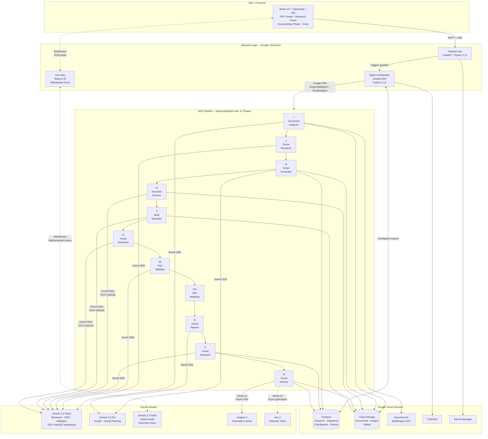

<div align="center">


# AI Historian

**Upload any historical document. Watch a self-generating documentary unfold while a living AI historian narrates, researches, and converses with you in real time.**

[](https://geminiliveagentchallenge.devpost.com/)
[](https://google.github.io/adk-docs/)
[](https://cloud.google.com/run)
[](https://react.dev)
[](https://python.org)
[](https://terraform.io)
[](LICENSE)

</div>

---

## What Is AI Historian?

AI Historian is not a chatbot. It is not a video editor. It is a **live AI persona** that takes any historical document you upload -- a medieval manuscript, a declassified government file, a letter in Ottoman script -- and immediately begins researching it, narrating it, and generating a cinematic documentary around it. While you read the document, parallel research agents fan out across the web. Within seconds, the first segment of your documentary is playing: AI-generated cinematic visuals, narrated by a historian who speaks with authority, cites real sources, and is always listening for your voice.

Speak mid-documentary. The historian stops mid-sentence within 300 milliseconds, answers your question with grounded evidence, generates a new illustration on the fly, and resumes exactly where it left off. Your questions reshape the documentary itself -- branching the narrative graph so that no two viewing sessions ever produce the same film.

This is the first system to combine **live multilingual OCR, parallel AI research with Google Search grounding, generative cinematic visuals (Imagen 3 + Veo 2), interleaved TEXT+IMAGE output from Gemini, and an always-on real-time voice persona (Gemini 2.5 Flash Native Audio)** into a single, seamless experience.

---

## What Makes It Different

| Capability | Description |
|:---|:---|
| **Any Document, Any Language** | Upload PDFs, scanned manuscripts, or photographs. Document AI OCR extracts text from 200+ languages, including dead scripts. The historian works with whatever you give it. |
| **11-Phase ADK Pipeline** | A `SequentialAgent` orchestrates 11 specialized phases -- from OCR to parallel research (with `google_search` grounding) to script generation to visual composition. Each phase emits real-time progress via SSE. |
| **Interleaved TEXT+IMAGE Generation** | Phases IV, V, and VI use Gemini's native interleaved output (`response_modalities=["TEXT","IMAGE"]`) to produce narration and storyboard illustrations in single model calls -- not sequential text-then-image. |
| **Cinematic Visual Generation** | Imagen 3 produces 4 cinematic frames per segment with era-accurate negative prompts. Veo 2 generates dramatic video clips asynchronously. Beat-aware routing decides which visual path each moment gets. |
| **Always-On Voice Persona** | Gemini 2.5 Flash Native Audio powers the historian. Sub-300ms interruption handling. Session resumption tokens survive disconnects. The historian never leaves the conversation. |
| **Grounded in Evidence** | Research agents use Google Search grounding. The fact validator (Phase VII) cross-references every narration claim against retrieved evidence. Firestore vector search (768-dim embeddings) enables RAG over the original document. |
| **Live Illustration** | When you ask a question, the historian can trigger on-the-fly Imagen 3 generation. The new image crossfades into the documentary player without breaking the viewing experience. |
| **Timeline Map** | Phase VIII extracts geographic locations and geocodes them via Gemini + Google Maps grounding. An interactive antique-style MapLibre map shows animated pins, historical routes, and fly-to transitions. |
| **Historian Avatar** | An AI-generated oil painting portrait with canvas-based lip sync animation driven by `AnalyserNode` audio data. The historian has a face. |
| **Adaptive Documentary** | User questions branch the narrative graph. The documentary restructures itself around your curiosity. Every session is unique. |

---

## Demo

<div align="center">

### Demo Video (4 min)

<!-- Replace with actual YouTube link -->
[](#)

> A 4-minute walkthrough showing: document upload, live expedition log with real-time agent progress, documentary playback with Ken Burns cinematic visuals, voice interruption mid-narration, question-driven narrative branching, and the interactive timeline map.

### Live Deployment

<!-- Replace with actual deployment URL -->
[](#)

</div>

---

## Architecture



**Reading the diagram:** The user's browser communicates with three Cloud Run services. The `historian-api` serves REST endpoints and SSE streams for real-time progress. The `agent-orchestrator` runs the 11-phase ADK pipeline -- a `SequentialAgent` that chains document analysis, parallel research (via `ParallelAgent` with N `google_search` subagents), script generation, interleaved TEXT+IMAGE storyboarding, fact validation, geographic mapping, visual research, and Imagen 3 / Veo 2 generation. The `live-relay` proxies WebSocket audio between the browser and the Gemini Live API for real-time voice interaction. All state flows through Firestore (with vector search for RAG), all media through Cloud Storage, and all secrets through Secret Manager.

---

## Google Cloud and Gemini Implementation

> This section documents every Google technology used, how it is accessed, and where in the codebase it appears.

### Gemini Models

| Model | Pipeline Phase | Purpose | Access Method |
|:---|:---|:---|:---|
| `gemini-2.0-flash` | I, II, IV, V, VI, VII, VIII, X | Scan Agent, Research (xN parallel), Interleaved TEXT+IMAGE (Narrative Director, Beat Illustrator, Visual Interleave), Fact Validator, Geo Mapping, Visual Research | Google GenAI SDK via ADK |
| `gemini-2.0-pro` | III, IX, Narrative Curator | Script Generation, Visual Story Planner, Document Curation | Google GenAI SDK via ADK |
| `gemini-2.5-flash-native-audio-preview-12-2025` | Real-time voice | Historian persona -- always-on narration, interruption, conversation | Gemini Live API (WebSocket `BidiGenerateContent`) |
| `gemini-embedding-2-preview` | RAG pipeline | 768-dim chunk embeddings + query embeddings for Firestore vector search | Google GenAI SDK |
| `imagen-3.0-fast-generate-001` | XI | 4 cinematic frames per segment with era-accurate negative prompts | Vertex AI via GenAI SDK |
| `veo-2.0-generate-001` | XI | Dramatic video clips (async long-running operations) | Vertex AI via GenAI SDK |

### Google Cloud Services

| Service | Purpose | Implementation |
|:---|:---|:---|
| **Cloud Run** | Backend hosting | 3 services: `historian-api` (FastAPI, Python 3.12, 2 vCPU / 2 GiB), `agent-orchestrator` (ADK, Python 3.12, 4 vCPU / 4 GiB), `live-relay` (Node.js 20 WebSocket proxy, 1 vCPU / 1 GiB) |
| **Vertex AI** | Model hosting | Imagen 3 image generation + Veo 2 video generation via `google-genai` client with `vertexai=True` |
| **Firestore** | State + vector DB | Sessions, segments, agent logs, phase checkpoints, chunk embeddings (768-dim) for RAG vector search |
| **Cloud Storage** | Media storage | Uploaded documents, OCR text, Imagen 3 frames, Veo 2 MP4 videos, storyboard illustrations |
| **Document AI** | Multilingual OCR | `OCR_PROCESSOR` extracts text from uploaded PDFs in 200+ languages including historical scripts |
| **Pub/Sub** | Event messaging | Async agent-to-API event propagation for real-time SSE delivery |
| **Secret Manager** | Credentials | Gemini API key, Document AI processor resource name |
| **Artifact Registry** | Container images | Docker images for all 3 Cloud Run services |

### SDK and Framework Usage

<details>
<summary><strong>Google ADK (google-adk)</strong> -- Agent Orchestration</summary>

The entire 11-phase pipeline is built on ADK primitives:

- **`SequentialAgent`** -- orchestrates the full pipeline from document analysis through visual generation
- **`ParallelAgent`** -- runs N research subagents concurrently (one per scene), each with `google_search` tool
- **`Agent`** -- individual agents for research, aggregation, script generation, fact validation
- **`BaseAgent`** -- custom agents (document analyzer, visual research orchestrator, visual director) that combine ADK lifecycle with direct GenAI SDK calls

State flows between phases via `output_key` -> `session.state[key]` -> downstream agent instruction templates.

</details>

<details>
<summary><strong>Google GenAI SDK (google-genai)</strong> -- Model Calls</summary>

All Gemini, Imagen 3, and Veo 2 calls use the official `google-genai` Python SDK:

- `client.aio.models.generate_content()` -- async text and multimodal generation
- `client.aio.models.generate_images()` -- Imagen 3 with negative prompts and safety settings
- `client.aio.models.generate_videos()` -- Veo 2 with async long-running operation polling
- `client.aio.models.embed_content()` -- 768-dim embeddings for RAG
- Interleaved `response_modalities=["TEXT","IMAGE"]` -- Phases IV, V, VI

</details>

<details>
<summary><strong>Gemini Live API</strong> -- Real-time Voice</summary>

The `live-relay` service maintains a persistent WebSocket connection to the Gemini Live API:

- Protocol: `BidiGenerateContent` over WebSocket
- Audio in: 16-bit PCM, 16 kHz, mono (from browser `AudioWorkletNode`)
- Audio out: 16-bit PCM, 24 kHz, mono (to browser `AudioBufferSourceNode`)
- Interruption: server-detected VAD, sub-300ms response
- Session resumption: `sessionResumptionUpdate.handle` tokens survive disconnects

</details>

<details>
<summary><strong>Terraform</strong> -- Infrastructure as Code</summary>

`terraform/main.tf` provisions the complete Google Cloud infrastructure with **19 resource definitions**:

- 3 Cloud Run services with full environment variable configuration
- Firestore database with composite indexes
- 2 Cloud Storage buckets (documents + assets)
- Pub/Sub topics and subscriptions
- Artifact Registry repository
- Secret Manager secrets
- Service account with least-privilege IAM bindings
- All required API enablements

```bash
cd terraform
cp terraform.tfvars.example terraform.tfvars
terraform init && terraform apply
```

</details>

### Bonus Points Pursued

| Bonus | Points | Evidence |
|:---|:---|:---|
| Published blog post with `#GeminiLiveAgentChallenge` | **+0.6** | Both team members (links in submission) |
| Automated Cloud deployment (IaC) | **+0.2** | `terraform/main.tf` -- 19 resources, single `terraform apply` |
| GDG membership | **+0.2** | Both team members (profile links in submission) |
| | **+1.0 total** | |

---

## The 11-Phase Agent Pipeline

AI Historian processes every uploaded document through an 11-phase agent pipeline built on the Google Agent Development Kit (ADK). Each phase is a custom `BaseAgent` subclass that coordinates direct API calls, ADK sub-agents, and Firestore persistence while streaming SSE progress events to the frontend in real time.

```
Document Upload
    |
    v
Phase I ---- Document Analyzer (OCR + Chunking + Curation)
    |
    v
Phase II --- Scene Research (Parallel google_search agents + Aggregator)
    |
    v
Phase III -- Script Generator (Per-scene narration + visual descriptions)
    |
    v
Phase IV -- Narrative Director (Interleaved TEXT+IMAGE storyboards)
    |
    v
Phase V --- Beat Illustrator (Per-beat TEXT+IMAGE fast path)
    |
    v
Phase VI -- Visual Interleave (Assign illustration / cinematic / video)
    |
    v
Phase VII - Fact Validator (Hallucination firewall)
    |
    v
Phase VIII  Geographic Mapping (Geocode + timeline map data)
    |
    v
Phase IX -- Narrative Visual Planner (VisualStoryboard + anachronism guards)
    |
    v
Phase X --- Visual Research (6-stage micro-pipeline per scene)
    |
    v
Phase XI -- Visual Director (Imagen 3 + Veo 2 generation)
    |
    v
Documentary Ready
```

All phases run inside a `SequentialAgent`. Two pipeline executors are available:

| Executor | Mode | Behavior |
|---|---|---|
| `ResumablePipelineAgent` | Batch | Checkpoint-aware, phase-level resume from Firestore. Runs all 11 phases sequentially. |
| `StreamingPipelineAgent` | Streaming | Runs global phases (I + II) once, then processes per-segment in parallel for faster first-segment delivery. Scene 0 runs first; scenes 1-N stagger with `asyncio.Semaphore(2)`. |

---

<details>
<summary><strong>Phase I -- Document Analyzer</strong></summary>

**What it does:** Extracts multilingual text from an uploaded PDF via Document AI OCR, splits it into semantic chunks, summarizes every chunk in parallel, then selects 2-4 cinematically compelling scenes with a Visual Bible style guide.

**Models:** Gemini 2.0 Flash (summarization, embedding), Gemini 2.0 Flash (narrative curation)

**Key technical details:**
- **OCR:** Google Document AI async client with automatic page splitting for documents exceeding the 15-page processor limit. Retries up to 3x with exponential backoff.
- **Semantic Chunker:** Rule-based Python splitter. Priority: page breaks (`\f`) > heading detection (numbered/roman/ALL-CAPS patterns) > topic shift heuristics (blank line + proper noun) > 3200-character hard fallback split at sentence boundaries.
- **Parallel Summarizer:** `asyncio.gather` with `Semaphore(10)` sends every chunk to Gemini 2.0 Flash concurrently. Failed chunks degrade to a 200-character raw-text fallback.
- **Narrative Curator:** ADK `Agent` (Gemini 2.0 Flash) reads the full Document Map and selects scenes, producing structured `SceneBrief` objects and a Visual Bible.
- **Background Embedding:** `gemini-embedding-2-preview` (768 dimensions) embeds all chunk summaries in batches of 250 via `asyncio.create_task` -- runs in the background without blocking Phase II. Vectors are written to Firestore for RAG retrieval during live voice sessions.

**Outputs:** `scene_briefs`, `visual_bible`, `document_map`, `gcs_ocr_path` in `session.state`

</details>

<details>
<summary><strong>Phase II -- Scene Research + Aggregator</strong></summary>

**What it does:** Spins up one `google_search`-only ADK Agent per scene brief, running all agents simultaneously via `ParallelAgent`. An aggregator then merges all research into a unified context with facts, citations, and contradiction flags.

**Model:** Gemini 2.0 Flash

**Key technical details:**
- ADK constraint: `google_search` **cannot be combined** with other tools in the same agent. Each scene researcher is search-only by design.
- Each agent reads its scene brief and source chunk texts from `session.state` via ADK template substitution (`{scene_0_brief}`, `{scene_0_chunks}`). The f-string escaping trick (`{{scene_{i}_brief}}`) produces the correct ADK template variable.
- Source chunks are fetched from Firestore in parallel via `asyncio.gather` before research begins.
- Each research agent evaluates sources against a 3-tier domain trust rubric (Tier 1: `.edu`, `.gov`, JSTOR; Tier 2: Wikipedia, Britannica; Tier 3: generic blogs), rejects AI-generated content, and assigns cross-reference confidence labels: `ESTABLISHED FACT`, `VERIFIED`, `UNVERIFIED`, `DISPUTED`.
- Normal mode: 3 searches per scene. Test mode: 1 search per scene.

**Outputs:** `research_0`...`research_N` (per-scene JSON), `aggregated_research` in `session.state`

</details>

<details>
<summary><strong>Phase III -- Script Orchestrator</strong></summary>

**What it does:** Generates a `SegmentScript` for each scene containing 60-120 seconds of narration, 4 visual descriptions, a Veo 2 scene prompt, mood, and source citations. Commits all segments to Firestore atomically.

**Model:** Gemini 2.0 Pro

**Key technical details:**
- Pydantic v2 `SegmentScript` model: `id`, `scene_id`, `title`, `narration_script`, `visual_descriptions`, `veo2_scene`, `mood`, `sources`.
- Firestore `WriteBatch` reduces 4-8 individual round-trips to 1 atomic commit.
- Emits `segment_update(status="generating")` SSE events per segment so the frontend displays skeleton cards with titles immediately.
- Output parser handles bare JSON arrays, `{"segments":[...]}` envelopes, and markdown code fences.

**Outputs:** `SegmentScript` documents in Firestore at `/sessions/{id}/segments/{segmentId}`

</details>

<details>
<summary><strong>Phase IV -- Narrative Director (Interleaved TEXT+IMAGE)</strong></summary>

**What it does:** Makes a single Gemini call per scene with `response_modalities=["TEXT","IMAGE"]` to produce both a creative direction note and a storyboard illustration in one pass. This is the primary implementation of Gemini's native interleaved output capability.

**Model:** Gemini 2.0 Flash (TEXT+IMAGE)

**Key technical details:**
- One API call produces two modalities simultaneously -- text and image interleaved in the response.
- Generated storyboard images are uploaded to GCS and stored as `storyboard_images` for use as visual references in Phase XI.

**Outputs:** `storyboard_images` (GCS URIs per scene)

</details>

<details>
<summary><strong>Phase V -- Beat Illustrator (Interleaved TEXT+IMAGE)</strong></summary>

**What it does:** Pre-generates narration beats with TEXT+IMAGE during the pipeline. Each segment is split into 3-4 beats, and each beat receives both narration text and an illustration from a single Gemini call.

**Model:** Gemini 2.0 Flash (TEXT+IMAGE)

**Key technical details:**
- Beat 0 is emitted immediately via a fast path so the player can start loading visuals as early as possible.
- Beats 1-N are generated concurrently via `asyncio.gather`.
- Beat images are the **primary visual path** for the documentary player -- most viewers see these images first.

**Outputs:** Beat narration + beat images per segment

</details>

<details>
<summary><strong>Phase VI -- Visual Interleave Agent</strong></summary>

**What it does:** Assigns each beat a `visual_type` that determines which generation path Phase XI uses, creating a mixed-modality playback sequence.

**Model:** Gemini 2.0 Flash

**Key technical details:**

| visual_type | Source | Generation |
|---|---|---|
| `illustration` | Phase V image | Already generated, no additional work |
| `cinematic` | Imagen 3 | Phase XI generates a new cinematic frame |
| `video` | Veo 2 | Phase XI generates a video clip |

**Output:** `beat_visual_plan` (per-beat visual type assignments)

</details>

<details>
<summary><strong>Phase VII -- Fact Validator (Hallucination Firewall)</strong></summary>

**What it does:** An LLM-judge cross-references every narration claim in the script against the research evidence gathered in Phase II. Overwrites the script in place with no changes to downstream agents.

**Model:** Gemini 2.0 Flash

**Key technical details:**
- Four verdict categories per claim:
  - `SUPPORTED` -- Keep as-is
  - `UNSUPPORTED_SPECIFIC` -- Remove the claim and bridge surrounding text
  - `UNSUPPORTED_PLAUSIBLE` -- Soften language ("may have" / "believed to")
  - `NON_FACTUAL` -- Skip entirely
- Latency: approximately 3-5 seconds per segment.
- Zero interface changes: downstream agents consume the same `SegmentScript` shape.

**Output:** Modified `SegmentScript` in Firestore (in-place overwrite)

</details>

<details>
<summary><strong>Phase VIII -- Geographic Mapping</strong></summary>

**What it does:** Extracts geographic locations from narration scripts, geocodes them via Gemini with Google Maps grounding, and writes structured geo data to Firestore for the interactive timeline map.

**Model:** Gemini 2.0 Flash

**Key technical details:**
- Writes `SegmentGeo` objects to Firestore and emits `geo_update` SSE events.
- Powers the frontend MapLibre GL timeline map with animated pins and route lines.

**Output:** `SegmentGeo` per segment in Firestore, `geo_update` SSE events

</details>

<details>
<summary><strong>Phase IX -- Narrative Visual Planner</strong></summary>

**What it does:** A single Gemini 2.0 Pro call produces a `VisualStoryboard` that guides all downstream visual generation with per-scene subjects, anachronism guards, targeted image search queries, and frame composition concepts.

**Model:** Gemini 2.0 Pro

**Key technical details:**
- Per-scene output includes: subjects to depict, objects to explicitly avoid (anachronism guards), targeted image search queries, and frame concepts for Imagen 3.
- This phase bridges the narrative script and the visual research pipeline.

**Output:** `VisualStoryboard` in `session.state`

</details>

<details>
<summary><strong>Phase X -- Visual Research Orchestrator</strong></summary>

**What it does:** Runs a 6-stage micro-pipeline per scene to transform each SceneBrief into a `VisualDetailManifest` -- a richly sourced, period-accurate Imagen 3 prompt grounded in real archival research. Uses **no ADK sub-agents**; all calls are direct `client.aio.models.generate_content` for full concurrency control.

**Model:** Gemini 2.0 Flash

**Key technical details:**

| Stage | Operation | Method |
|---|---|---|
| 0 | Generate 5-7 image search queries | Gemini |
| 1 | Web search with Google Search grounding | `types.Tool(google_search=GoogleSearch())` |
| 2 | Source typing (webpage / Wikipedia / PDF / image) | Gemini |
| 3 | Content fetch | httpx + BeautifulSoup, Wikipedia REST API, Document AI (PDF), Gemini multimodal `FileData` (image) |
| 4 | Source evaluation (accept/reject per scene brief) | Gemini |
| 5 | Detail synthesis | Gemini |
| 6 | Merge into `VisualDetailManifest` | Gemini |

Two concurrent tracks run via `asyncio.gather`:
- **Fast path (Scene 0):** 3 sources max, early exit at 2 accepted, skips PDFs and images. Target: manifest ready within 35 seconds.
- **Deep path (Scenes 1-N):** 8-10 sources, all source types enabled, no early exit.

**Outputs:** `VisualDetailManifest` per scene in Firestore at `/sessions/{id}/visualManifests/{sceneId}`, `visual_research_manifest` in `session.state`

</details>

<details>
<summary><strong>Phase XI -- Visual Director</strong></summary>

**What it does:** Beat-aware visual generation that reads Phase VI's visual plan and dispatches each beat to the appropriate generator: keep existing illustration, generate an Imagen 3 cinematic frame, or generate a Veo 2 video clip.

**Models:** Imagen 3 (`imagen-3.0-fast-generate-001`), Veo 2 (`veo-2.0-generate-001`)

**Key technical details:**
- **Imagen 3 prompts:** Built from enriched manifest (priority 1), script `visual_descriptions` (priority 2), or generic fallback (priority 3). Each segment gets 4 concurrent frame calls with distinct composition modifiers (wide, medium, close-up, dramatic). Era-specific negative prompts prevent anachronisms.
- **Progressive delivery:** Scene 0 generates first. Its images are emitted via `segment_update` SSE before any subsequent scene starts, targeting the < 45s first-segment goal.
- **Remaining scenes:** Run concurrently via `asyncio.gather`.
- **Veo 2 polling:** Each segment's video operation is polled in a fire-and-forget `asyncio.create_task` using `run_in_executor` (the `client.operations.get` API is sync-only). 30 polls max at 20-second intervals (10-minute timeout). Firestore is updated with `videoUrl` on completion.

**Outputs:** `imageUrls[]` and `videoUrl` per segment in Firestore, `segment_update(status="complete")` SSE events

</details>

---

## Live Historian Voice

The Historian is an always-on AI persona that narrates, converses, and listens simultaneously. It runs on the Gemini Live API (`BidiGenerateContent`) via a WebSocket relay service on Cloud Run.

### Voice Architecture

```
Browser (microphone)
    | PCM 16-bit, 16 kHz, mono, 1024-byte chunks
    v
WebSocket connection
    |
    v
live-relay (Node.js, Cloud Run)     <-- Session context from Firestore
    |                                    Persona prompt injection
    | WebSocket                          RAG retrieval interception
    v                                    Live illustration dispatch
Gemini Live API
    (gemini-2.5-flash-native-audio-preview-12-2025)
    |
    | PCM 16-bit, 24 kHz, mono
    v
live-relay
    |
    v
Browser (Web Audio API playback via AudioBufferSourceNode)
```

### Capabilities

| Capability | Implementation |
|---|---|
| Always-on listening | Historian listens while the documentary plays. `automaticActivityDetection` handles voice activity detection server-side. |
| Sub-300ms interruption | Gemini detects user speech and sends `serverContent.interrupted = true`. The client immediately stops audio playback and clears the queue. |
| Session resumption | Stores `sessionResumptionUpdate.handle` tokens in Firestore. On `goAway` or disconnect, reconnects with the token (valid 2 hours). Falls back to a fresh session if the token is expired. |
| Context compression | `contextWindowCompression.slidingWindow` keeps the conversation going beyond the 15-minute session limit. |
| Persona system | Multiple historian personas (Professor, Explorer, Storyteller). System instruction combines persona prompt + documentary context from Firestore (segment titles, scripts, sources, visual bible). |
| Output transcription | Real-time speech-to-text captions from `outputTranscription.text` events forwarded to the browser for the caption track. |

### RAG Grounding

When the user asks a question, the relay intercepts the transcript and retrieves relevant document passages to inject into the conversation:

```
User speaks
    |
    v
Gemini Live API sends inputTranscript event
    |
    v
live-relay accumulates transcript fragments
    |  (debounced, triggers when > 15 chars)
    v
POST /api/session/{id}/retrieve  (1.5s timeout via AbortSignal)
    |
    v
historian-api embeds query with gemini-embedding-2-preview
    |
    v
Firestore find_nearest() -- top-4 chunks by cosine distance
    |
    v
live-relay injects retrieved passages as clientContent turn
    |
    v
Historian responds with document-grounded knowledge
```

Every step is best-effort. If the RAG call fails, times out, or returns no results, the historian answers from its existing context. The voice session is never interrupted by a retrieval failure.

Query results are cached for 60 seconds per session (max 20 entries) to avoid redundant embedding calls for repeated or similar questions.

### Live Illustration

When the historian describes a vivid scene, location, or key figure during conversation, Gemini autonomously triggers an illustration via a `NON_BLOCKING` function call:

1. Gemini sends a `generate_illustration` function call with `subject`, `mood`, and `composition` parameters while continuing to speak.
2. The live-relay dispatches the call to `POST /api/session/{id}/illustrate` (15-second timeout).
3. The historian-api generates an Imagen 3 image using the session's Visual Bible for style consistency.
4. The generated image URL is sent to the browser as a `live_illustration` WebSocket message.
5. The frontend displays the image with a cinematic crossfade transition.
6. A `FunctionResponse` is sent back to Gemini confirming the image is visible, with `turnComplete: false` so the historian's speech is not interrupted.

The historian never pauses to wait for the illustration. Generation and narration happen concurrently.

---

## Frontend Experience

The frontend is a cinematic application layer built to maximize the Innovation and Multimodal UX judging criterion (40% weight). Three screens guide the user from upload to documentary playback.

### Three Screens

**1. Upload** -- Drag-and-drop zone with format badges (PDF, scanned manuscripts), language detection tags, and an animated upload progress bar. Magnetic pull draws the primary CTA toward the cursor.

**2. Workspace** -- Split layout with resizable panels:
- Left: PDF viewer with scrollable pages and entity highlighting
- Right: Historian Live panel + Research Activity panel (living agent cards with 5-state visual machine) + Segment cards (skeleton-to-content morphing with synchronized shimmer)
- The Expedition Log loading pattern narrates pipeline progress as a journal rather than showing spinners

**3. Player** -- Full-screen cinematic experience:
- Ken Burns pan-and-zoom on Imagen 3 stills (audio-reactive speed via AnalyserNode)
- Veo 2 video playback for dramatic segments
- Word-by-word caption track synced to narration
- Interactive antique-style timeline map (MapLibre GL) with animated pins
- Living Portrait avatar with canvas-based lip sync
- Always-on voice button with organic waveform visualization
- All chrome auto-hides after 3 seconds of inactivity

### Frontend Tech Stack

| Package | Version | Role |
|---|---|---|
| React | 19 | Concurrent rendering, `startTransition` for SSE updates |
| Vite | 7 | Build tool, instant HMR, ESBuild transforms |
| TypeScript | 5.x strict | Full type safety, no `any` |
| Tailwind CSS | v4 | CSS-first config, Lightning CSS engine |
| Zustand | 5 | Client state with sessionStorage persistence |
| Motion | 12 | All animations -- springs, `AnimatePresence`, `layoutId` transitions |
| TanStack Query | v5 | Server state, SSE stream management |
| MapLibre GL | 5.x | Interactive antique-style timeline map |
| Canvas API | native | Living Portrait avatar with lip sync |
| Radix UI | latest | Accessible headless components (Dialog, Tooltip, Collapsible) |
| Sonner | 2.x | Toast notifications |
| pdfjs-dist | latest | PDF rendering with text layer extraction |
| Web Audio API | native | Mic capture (AudioWorkletNode, 16 kHz PCM), playback (24 kHz), AnalyserNode for waveform and audio-reactive visuals |

### Cinematic Design Elements

- **Film grain overlay** -- SVG `feTurbulence` filter at 2.5% opacity with `mix-blend-mode: multiply`. Animated `grain-shift` keyframe adds tactile material quality.
- **Iris reveal transition** -- `@property --iris-r` animates a `radial-gradient` mask between Workspace and Player. 0.65s iris close, 0.75s iris open. The single highest-impact animation in the app.
- **Audio-reactive Ken Burns** -- `useAudioVisualSync` hook reads `AnalyserNode` energy each `requestAnimationFrame` and drives CSS custom properties: `--ken-speed` (28s silence to 20s peak), `--glow-opacity`, `--vig-spread`.
- **Cipher/decode text reveal** -- Segment titles decode from ancient Greek/Cyrillic glyphs to actual text over 600ms via `useTextScramble` hook.
- **Word-by-word caption reveal** -- Captions reveal one word at a time with `blur(4px) -> blur(0)` entrance synced to narration timing.
- **Expedition Log** -- Pipeline waiting is presented as the first act of the documentary. Phase markers, self-drawing dividers, typewriter log entries at 20ms/char with random jitter, and accumulation counters (SOURCES FOUND / FACTS VERIFIED / SEGMENTS READY).
- **Living agent cards** -- Five-state visual machine per agent (queued, searching, evaluating, done, error) with animated conic-gradient borders, spotlight glow halos, and spring-physics morph transitions.

---

## Performance

### Targets

| Metric | Target |
|---|---|
| First segment playable | < 45 seconds from upload |
| Voice interruption latency | < 300ms |
| Historian response start | < 1.5 seconds after user speech ends |
| Research per agent | < 30 seconds |
| Imagen 3 generation | ~5 seconds per image |
| Frontend initial bundle | < 200KB gzipped |
| Animation frame budget | 60fps maintained |

### Optimizations

| Layer | Optimization | Impact |
|---|---|---|
| Pipeline | Scene 0 fast path (3 sources, early exit at 2 accepted) | First segment playable under 45s |
| Pipeline | `StreamingPipelineAgent` with per-segment parallelism | Global phases run once; segments process concurrently |
| Pipeline | Veo 2 fire-and-forget background tasks | Video polling never blocks Imagen 3 generation |
| Backend | Firestore `WriteBatch` for script commits | 4-8 round-trips reduced to 1 atomic commit |
| Backend | `GlobalRateLimiter` with Retry-After backoff | No 429 cascades across concurrent agents |
| Backend | GCS client singleton + bucket cache | No per-upload connection pool overhead |
| Backend | Background embedding via `asyncio.create_task` | Phase II starts immediately; vectors write in parallel |
| Frontend | `React.memo` on AgentCard / SegmentCard, `useShallow` selectors | No cascading re-renders from SSE updates |
| Frontend | SSE adaptive drip buffer (1/3/8 events per 150ms tick) | 50-event burst absorbed gracefully instead of frame drops |
| Frontend | Lazy-loaded pages via `React.lazy` + `Suspense` | Smaller initial bundle, faster first paint |
| Frontend | React Compiler (babel-plugin-react-compiler) | Automatic memoization of components and hooks |
| Voice | RAG query result cache (60s TTL, 20-entry LRU) | Repeated questions skip embedding + Firestore lookup |
| Voice | System instruction cache (15-min TTL) | Firestore context fetched once per session, not per reconnect |

---

## Tech Stack

### AI Models

| Model | Role |
|:---|:---|
| `gemini-2.5-flash-native-audio-preview-12-2025` | Historian persona -- Gemini Live API, real-time bidirectional voice |
| `gemini-2.0-pro` | Script generation, Visual Planner, Narrative Curator |
| `gemini-2.0-flash` | Scan Agent, Research Subagents, Fact Validator, Visual Research, Interleaved TEXT+IMAGE (Phases IV, V, VI), Geo Mapping |
| `gemini-embedding-2-preview` | Chunk summary embeddings (768 dims) + RAG query embedding |
| `imagen-3.0-fast-generate-001` | Scene images -- 4 frames per segment, ~5s each |
| `veo-2.0-generate-001` | Dramatic video clips -- async generation, 1--2 min each |

### Google Cloud Services

| Service | Role |
|:---|:---|
| **Cloud Run** | All 3 backend services (`historian-api`, `agent-orchestrator`, `live-relay`) |
| **Vertex AI** | Imagen 3, Veo 2, Gemini model hosting |
| **Gemini Live API** | Real-time bidirectional voice streaming |
| **Firestore** | Sessions, segments, checkpoints, vector search (768-dim cosine) |
| **Cloud Storage** | Uploaded documents, generated images, MP4 videos |
| **Document AI** | Multilingual OCR -- 200+ languages including dead scripts |
| **Pub/Sub** | Async event messaging between services |
| **Secret Manager** | API keys, service credentials |
| **Artifact Registry** | Docker images for all Cloud Run services |

### Backend

| Package | Version | Role |
|:---|:---|:---|
| `google-adk` | latest | Agent orchestration -- `SequentialAgent`, `ParallelAgent`, `Agent` |
| `google-genai` | latest | Gemini, Imagen 3, Veo 2 API calls |
| `google-cloud-documentai` | latest | OCR processing |
| `FastAPI` | 0.115+ | HTTP API gateway + SSE streaming |
| `uvicorn` | latest | ASGI server |
| `Pydantic` | v2 | Request/response models with strict typing |

### Frontend

| Package | Version | Role |
|:---|:---|:---|
| React | 19 | UI framework -- concurrent rendering |
| Vite | 7 | Build tool -- instant HMR, sub-second cold starts |
| TypeScript | 5.x strict | Full type safety, no `any` |
| Tailwind CSS | v4 | CSS-first config, Lightning CSS engine |
| Zustand | 5 | Client state -- session, research, voice, player stores |
| Motion | 12 | All animations -- springs, gestures, layout transitions |
| TanStack Query | v5 | Server state -- REST polling, SSE stream management |
| MapLibre GL | 5.x | Interactive timeline map with animated markers |
| Radix UI | latest | Accessible headless primitives (Dialog, Tooltip) |
| Sonner | 2.x | Toast notifications |
| pdfjs-dist | latest | PDF rendering with text layer extraction |

### Infrastructure

| Tool | Role |
|:---|:---|
| Terraform | Full IaC -- 18 resource types in `terraform/main.tf` |
| Docker | Container images for 3 Cloud Run services |
| pnpm | Package manager (frontend + live-relay) |

---

## Getting Started

### Prerequisites

- Google Cloud project with billing enabled
- `gcloud` CLI installed and authenticated
- Terraform >= 1.5
- Docker
- Node.js 20+
- Python 3.12+
- pnpm

### Step 1 -- Clone and Configure

```bash
git clone https://github.com/pancodo/gemini-live-agent-challenge
cd gemini-live-agent-challenge
cp backend/.env.example backend/.env
```

Edit `backend/.env` and fill in:

| Variable | Description |
|:---|:---|
| `GCP_PROJECT_ID` | Your Google Cloud project ID |
| `GCS_BUCKET_NAME` | GCS bucket for documents and generated assets |
| `DOCUMENT_AI_PROCESSOR_NAME` | Full Document AI processor resource name |

### Step 2 -- Provision Infrastructure

```bash
cd terraform
terraform init
terraform apply \
  -var="project_id=YOUR_PROJECT_ID" \
  -var="gemini_api_key=YOUR_GEMINI_API_KEY"
```

This single command provisions all infrastructure:

- Firestore database (Native mode)
- GCS buckets for documents and generated assets
- Pub/Sub topics and subscriptions
- Secret Manager secrets
- Artifact Registry repository
- 3 Cloud Run services (placeholder images on first deploy)
- Service account with all required IAM roles
- All necessary GCP API enablements

### Step 3 -- Create Firestore Vector Index

```bash
gcloud firestore indexes composite create \
  --collection-group=chunks \
  --query-scope=COLLECTION \
  --field-config field-path=embedding,vector-config='{"dimension":"768","flat":"{}"}' \
  --database="(default)" \
  --project=YOUR_PROJECT_ID
```

This index takes 5--15 minutes to provision. It is required for the live historian's RAG-based document grounding -- enabling vector search over chunk embeddings so the voice persona can cite specific passages from the uploaded document.

### Step 4 -- Build and Deploy

```bash
PROJECT_ID=YOUR_PROJECT_ID
REGION=us-central1
REGISTRY=${REGION}-docker.pkg.dev/${PROJECT_ID}/historian

# Authenticate Docker to Artifact Registry
gcloud auth configure-docker ${REGION}-docker.pkg.dev

# Build and push all 3 services
docker build -t ${REGISTRY}/historian-api:latest \
  -f backend/historian_api/Dockerfile backend/
docker push ${REGISTRY}/historian-api:latest

docker build -t ${REGISTRY}/agent-orchestrator:latest \
  -f backend/agent_orchestrator/Dockerfile backend/
docker push ${REGISTRY}/agent-orchestrator:latest

docker build -t ${REGISTRY}/live-relay:latest \
  -f backend/live_relay/Dockerfile backend/live_relay/
docker push ${REGISTRY}/live-relay:latest

# Deploy real images to Cloud Run
cd terraform
terraform apply \
  -var="project_id=$PROJECT_ID" \
  -var="gemini_api_key=YOUR_GEMINI_API_KEY" \
  -var="deploy_real_images=true"
```

### Step 5 -- Configure Secrets and Frontend

```bash
# Set Document AI processor secret
echo -n "projects/YOUR_PROJECT/locations/us/processors/YOUR_PROCESSOR_ID" | \
  gcloud secrets versions add document-ai-processor-name --data-file=-

# Get deployed service URLs from Terraform
terraform output historian_api_url    # Use as VITE_API_BASE_URL
terraform output live_relay_url       # Use as VITE_RELAY_URL

# Run the frontend
cd frontend
pnpm install
cat > .env.local << EOF
VITE_API_BASE_URL=https://YOUR_HISTORIAN_API_URL
VITE_RELAY_URL=wss://YOUR_LIVE_RELAY_URL
EOF
pnpm dev
```

Open `http://localhost:5173` and upload a document.

<details>
<summary><strong>Local Development (No Docker)</strong></summary>

For rapid iteration without container builds:

```bash
# Terminal 1 -- Backend
cd backend
python -m venv .venv && source .venv/bin/activate
pip install google-adk google-genai google-cloud-documentai \
            google-cloud-firestore google-cloud-storage \
            fastapi uvicorn pydantic
./start.sh --reload

# Terminal 2 -- Frontend
cd frontend
pnpm install
pnpm dev
```

The backend `start.sh` script starts both `historian-api` and `agent-orchestrator` locally. The live-relay service requires a separate `cd backend/live_relay && pnpm install && pnpm dev`.

</details>

---

## Reproducible Testing

Once the application is running (either deployed on Cloud Run or locally), follow these steps to verify every major feature.

### Quick Test (< 5 minutes)

The app ships with **5 sample historical documents** — no need to find your own PDF.

1. **Open the app** at `http://localhost:5173` (local) or the deployed Cloud Run URL
2. **Select a sample document** — click any of the pre-loaded documents on the upload page (e.g., "Tutankhamun" or "Fall of Constantinople")
3. **Watch the Expedition Log** — the 11-phase pipeline begins immediately. You will see:
   - Phase markers appearing in sequence (I through XI)
   - Typewriter-animated log entries from each agent
   - Stats counters incrementing (sources found, facts verified, segments ready)
   - Agent cards transitioning through states: queued → searching → evaluating → done
4. **Enter the Documentary Player** — once segments are ready, click "Watch Documentary" to enter the cinematic player:
   - Ken Burns pan/zoom animation on AI-generated images
   - Word-by-word caption reveal synced to narration
   - Iris reveal transition (radial mask opening)
   - Auto-hiding player controls after 3 seconds of inactivity
5. **Test voice interaction** — click the voice button (bottom center) and speak:
   - Ask a question about the document (e.g., "How was the tomb discovered?")
   - The historian stops mid-narration within ~300ms
   - Responds with grounded evidence, then resumes the documentary
6. **Check the Timeline Map** — in the player sidebar, the map shows geocoded locations from the document with animated pins and historical routes

### What to Verify

| Feature | Where to Look | Expected Behavior |
|:---|:---|:---|
| Document upload | Upload page | Drag-and-drop or click sample → redirect to workspace |
| Real-time pipeline progress | Workspace → Expedition Log | Agent phases stream in via SSE, log entries typewrite |
| Agent detail inspection | Click any agent card | Modal opens with timestamped logs, source evaluations |
| Segment generation | Workspace → segment cards | Skeleton shimmer → title appears → images load |
| Cinematic playback | Player page | Ken Burns visuals, captions, audio narration |
| Voice interruption | Player → voice button | Historian stops, answers, resumes in < 2 seconds |
| Timeline map | Player sidebar → map tab | Antique-style map with pins at document locations |
| Living portrait | Player → historian avatar | Canvas-rendered portrait with lip sync during speech |
| Narrative branching | Ask a question during playback | New segment generated based on your question |

### Sample Documents Included

| Document | Topic | Pages | Good For Testing |
|:---|:---|:---|:---|
| `sample-tutankhamun.pdf` | Egyptian pharaoh, golden mask, tomb discovery | 29 | Rich visual scenes, geographic locations |
| `sample-fall-of-constantinople.pdf` | 1453 Ottoman siege, end of Byzantium | 28 | Military history, multiple locations |
| `sample-machu-picchu.pdf` | Inca citadel, Andes mountains | 26 | Architecture, geography, timeline map |
| `sample-colosseum.pdf` | Roman amphitheater, gladiators | 22 | Fastest pipeline run (fewer pages) |
| `sample-pompeii.pdf` | Volcanic destruction, archaeological finds | — | Dramatic visuals, scientific research |

> **Tip:** For the fastest end-to-end test, use "Colosseum" (fewest pages → fastest pipeline). For the most visually dramatic result, use "Tutankhamun" or "Pompeii."

### Upload Your Own Document

You can also upload any PDF. The system handles:
- Documents in **200+ languages** including historical scripts (Ottoman, Ancient Greek, Hieroglyphic)
- Scanned manuscripts and photographs (Document AI OCR)
- Multi-page documents (automatically chunked and curated)

---

## Project Structure

```
/
├── terraform/
│   └── main.tf                              Full GCP provisioning (18 resource types)
│
├── frontend/
│   └── src/
│       ├── components/
│       │   ├── upload/                      DropZone, FormatBadge, PersonaSelector
│       │   ├── workspace/                   WorkspaceLayout, PDFViewer, ResearchPanel,
│       │   │                                HistorianPanel, AgentModal, SegmentCard,
│       │   │                                ExpeditionLog, StoryboardStream, TopNav
│       │   ├── player/                      DocumentaryPlayer, KenBurnsStage, TimelineMap,
│       │   │                                CaptionTrack, PlayerSidebar, IrisOverlay,
│       │   │                                SourcePanel, ShareButton, BranchTree
│       │   ├── voice/                       VoiceButton, Waveform, VoiceLayer, LiveToast,
│       │   │                                LivingPortrait (canvas)
│       │   └── ui/                          Button, InkButton, Badge, Spinner, Modal
│       ├── hooks/                           useSSE, useGeminiLive, useAudioCapture,
│       │                                    useAudioPlayback, useAudioVisualSync,
│       │                                    usePortraitRenderer, useLipSync,
│       │                                    useTextScramble, useVoiceState, useSegmentGeo
│       ├── store/                           sessionStore, researchStore, voiceStore, playerStore
│       ├── services/                        api.ts, upload.ts (GCS signed URL)
│       └── pages/                           LandingPage, UploadPage, WorkspacePage, PlayerPage
│
├── backend/
│   ├── historian_api/
│   │   └── routes/
│   │       ├── session.py                   Session lifecycle, SSE, signed URL refresh
│   │       ├── pipeline.py                  Pipeline trigger, segment endpoints
│   │       ├── retrieve.py                  RAG vector search endpoint
│   │       ├── illustrate.py                Live Imagen 3 on user questions
│   │       └── narrate.py                   Beat-driven interleaved narration
│   │
│   ├── agent_orchestrator/
│   │   └── agents/
│   │       ├── pipeline.py                  ResumablePipelineAgent + StreamingPipelineAgent
│   │       ├── document_analyzer.py         Phase I -- OCR + chunking + curation
│   │       ├── scene_research_agent.py      Phase II -- parallel google_search research
│   │       ├── script_agent_orchestrator.py Phase III -- script generation
│   │       ├── narrative_director_agent.py  Phase IV -- TEXT+IMAGE storyboard
│   │       ├── beat_illustration_agent.py   Phase V -- TEXT+IMAGE beat visuals
│   │       ├── visual_interleave_agent.py   Phase VI -- visual type assignment
│   │       ├── fact_validator_agent.py      Phase VII -- hallucination firewall
│   │       ├── geo_location_agent.py        Phase VIII -- geographic mapping
│   │       ├── narrative_visual_planner.py  Phase IX -- visual storyboard planning
│   │       ├── visual_research_orchestrator.py  Phase X -- 6-stage visual detail pipeline
│   │       └── visual_director_orchestrator.py  Phase XI -- Imagen 3 + Veo 2 generation
│   │
│   └── live_relay/                          Node.js WebSocket proxy + RAG injection
│
└── docs/
    ├── spec/                                Product specs, frontend plan, resources
    ├── architecture/                        Diagrams
    ├── demo/                                Demo script (7-shot shot list)
    └── plans/                               Engineering design documents
```

---

## Team

<table>
<tr>
<td width="50%">

**Berkay** -- Live Voice Layer & Real-Time Interaction

`live-relay` service, Gemini Live API integration, browser audio pipeline (PCM capture + playback), interruption handling, voice button state machine, session resumption with compression, RAG context injection, transcript forwarding

</td>
<td width="50%">

**Efe** -- Research Pipeline, Agent Visualization & Documentary Engine

ADK 11-phase pipeline, Gemini interleaved TEXT+IMAGE, Document AI OCR, FastAPI gateway, SSE streaming, documentary player, Research Panel, Timeline Map, Living Portrait avatar, live illustration, light/dark theme system

</td>
</tr>
</table>

---

<div align="center">


<br />

Built for the **Gemini Live Agent Challenge** by Google

`#GeminiLiveAgentChallenge`

<br />

[MIT License](LICENSE)

</div>
