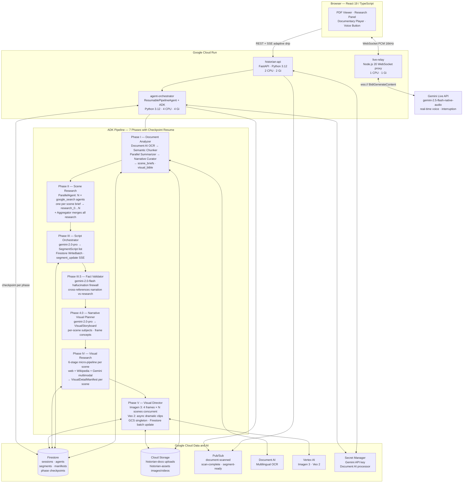

# AI Historian

AI Historian turns any historical document into a self-generating cinematic documentary. Upload a PDF or scanned manuscript — AI agents research it in parallel while you read, then produce narrated video segments with cinematic visuals. A live historian persona is always on, always listening, and responds to questions mid-documentary without breaking the experience.

Built for the **[Gemini Live Agent Challenge](https://geminiliveagentchallenge.devpost.com/)** — targeting Grand Prize + Best Creative Storytellers.

---

## Architecture



---

## Tech Stack

| Layer | Technology |
|---|---|
| **Frontend** | React 19, TypeScript, Vite 6, Tailwind CSS v4, Zustand 5, Motion 12, TanStack Query v5 |
| **Backend gateway** | Python 3.12, FastAPI, Cloud Run |
| **Agent pipeline** | Google ADK (`google-adk`), ResumablePipelineAgent, SequentialAgent + ParallelAgent |
| **AI models** | Gemini 2.0 Flash (agents), Gemini 2.0 Pro (script + visual planner), Gemini 2.5 Flash Native Audio (voice) |
| **Generative media** | Imagen 3 (4 frames per segment), Veo 2 (cinematic video clips) |
| **Voice relay** | Node.js 20, WebSocket, Cloud Run |
| **Storage** | Firestore (sessions, agents, segments, checkpoints), Cloud Storage, Pub/Sub, Document AI |
| **IaC** | Terraform — `terraform apply` provisions all infrastructure |

---

## Prerequisites

- Google Cloud project with billing enabled
- `gcloud` CLI authenticated: `gcloud auth application-default login`
- Terraform ≥ 1.6
- Docker (for building and pushing images)
- Node.js 20, Python 3.12, `pnpm`

---

## Setup

### 1. Clone and configure

```bash
git clone https://github.com/pancodo/gemini-live-agent-challenge
cd gemini-live-agent-challenge

cp backend/.env.example backend/.env
# Edit backend/.env — fill in GCP_PROJECT_ID, GCS_BUCKET_NAME, DOCUMENT_AI_PROCESSOR_NAME
```

### 2. Provision infrastructure with Terraform

```bash
cd terraform
terraform init
terraform apply \
  -var="project_id=YOUR_PROJECT_ID" \
  -var="gemini_api_key=YOUR_GEMINI_API_KEY"
```

Provisions: Firestore, GCS buckets, Pub/Sub, Secret Manager, Artifact Registry, Cloud Run services (historian-api, agent-orchestrator, live-relay), service account with all required IAM roles.

### 3. Build and push Docker images

```bash
PROJECT_ID=YOUR_PROJECT_ID
REGION=us-central1
REGISTRY=${REGION}-docker.pkg.dev/${PROJECT_ID}/historian

gcloud auth configure-docker ${REGION}-docker.pkg.dev

# historian-api
docker build -t ${REGISTRY}/historian-api:latest backend/historian_api/
docker push ${REGISTRY}/historian-api:latest

# agent-orchestrator (ADK pipeline)
docker build -t ${REGISTRY}/agent-orchestrator:latest backend/agent_orchestrator/
docker push ${REGISTRY}/agent-orchestrator:latest

# live-relay (Node.js WebSocket proxy)
docker build -t ${REGISTRY}/live-relay:latest backend/live_relay/
docker push ${REGISTRY}/live-relay:latest
```

### 4. Set Document AI processor secret

```bash
echo -n "projects/YOUR_PROJECT/locations/us/processors/YOUR_PROCESSOR_ID" | \
  gcloud secrets versions add document-ai-processor-name --data-file=-
```

### 5. Get service URLs

```bash
terraform output historian_api_url    # → set as VITE_API_BASE_URL in frontend
terraform output live_relay_url       # → set as VITE_RELAY_URL in frontend
```

### 6. Run frontend

```bash
cd frontend
pnpm install
echo "VITE_API_BASE_URL=https://YOUR_HISTORIAN_API_URL" > .env.local
pnpm dev
# Open http://localhost:5173
```

---

## Local Development (no Docker)

```bash
# Backend
cd backend
pip install google-adk google-genai google-cloud-documentai \
            google-cloud-firestore google-cloud-storage \
            fastapi uvicorn pydantic
./start.sh --reload

# Frontend
cd frontend
pnpm install
pnpm dev
```

---

## Agent Pipeline

```
Document upload → GCS

  Phase I      Document AI OCR → Semantic Chunker → Parallel Summarizer → Narrative Curator
               → scene_briefs, visual_bible, document_map

  Phase II     ParallelAgent: N google_search researchers (one per scene brief)
               → research_0 … research_N (facts, sources, visual_prompt per scene)
               + Aggregator merges all research into unified context

  Phase III    Script Orchestrator (gemini-2.0-pro) → SegmentScript list
               → narration_script, visual_descriptions, veo2_scene, mood, sources
               → Firestore WriteBatch (all segments in one commit)

  Phase III.5  Fact Validator (gemini-2.0-flash) — hallucination firewall
               → cross-references narration claims against research evidence
               → removes or softens unsupported claims before visual production

  Phase 4.0    Narrative Visual Planner (gemini-2.0-pro) → VisualStoryboard
               → per-scene primary subjects, avoid lists, targeted searches, 4 frame concepts

  Phase IV     Visual Research Orchestrator — 6-stage micro-pipeline per scene
               → web scraping, Wikipedia REST API, Document AI inline OCR, Gemini multimodal
               → VisualDetailManifest per scene (enriched period-accurate prompts)

  Phase V      Visual Director
               → Imagen 3: 4 frames × N scenes concurrent (~5s each, GCS client singleton)
               → Veo 2: dramatic clips async, polled until complete (~60–120s each)
               → Firestore batch update: imageUrls[], videoUrl per segment

  Checkpointing: ResumablePipelineAgent saves state to Firestore after each phase.
                 On restart, completed phases are skipped and state is restored.
```

Frontend subscribes to `GET /api/session/{id}/stream` (SSE) throughout. The SSE hook uses adaptive drip batching — 1, 3, or 8 events per 150ms tick depending on queue depth — so parallel agent bursts resolve in ~1 second instead of 7+ seconds.

---

## Performance Architecture

| Layer | Optimization | Impact |
|---|---|---|
| **Frontend** | `React.memo` on AgentCard + SegmentCard; `useShallow` Zustand selectors; `useMemo` for agent grouping | Eliminates cascading re-renders on every agent status update |
| **Frontend** | SSE adaptive batch drip (1/3/8 events per 150ms tick, single `startTransition`) | 50-event burst: 7.5s → ~1s catch-up |
| **Frontend** | Canvas resize guard in Waveform — only resizes on layout change | Eliminates 60 GPU buffer flushes/second during audio playback |
| **Backend** | Firestore `WriteBatch` for segment writes in Script Orchestrator | 4–8 sequential round-trips → 1 atomic commit |
| **Backend** | `GlobalRateLimiter` with `locked()` public API + Retry-After header support | Correct backoff under Gemini quota pressure |
| **Backend** | GCS `storage.Client()` singleton + `Bucket` cache in Visual Director | Eliminates per-upload HTTP connection pool creation during concurrent Imagen 3 generation |

---

## Project Structure

```
/
├── terraform/              Infrastructure as Code (terraform apply provisions everything)
│   └── main.tf
├── frontend/               React 19 + Vite 6 + Tailwind v4
│   └── src/
│       ├── components/     upload/ workspace/ player/ voice/ ui/
│       ├── hooks/          useSSE (adaptive drip), useGeminiLive, useAudioCapture,
│       │                   useAudioPlayback, useAudioVisualSync, useTextScramble
│       ├── store/          sessionStore, researchStore, voiceStore, playerStore
│       ├── services/       api.ts, upload.ts
│       └── pages/          UploadPage, WorkspacePage, PlayerPage (all lazy-loaded)
├── backend/
│   ├── historian_api/      FastAPI gateway — session, SSE stream, status, segments
│   ├── agent_orchestrator/
│   │   └── agents/
│   │       ├── pipeline.py                   ResumablePipelineAgent (checkpoint-aware)
│   │       ├── document_analyzer.py          Phase I
│   │       ├── scene_research_agent.py       Phase II
│   │       ├── script_agent_orchestrator.py  Phase III (WriteBatch)
│   │       ├── fact_validator_agent.py       Phase III.5
│   │       ├── narrative_visual_planner.py   Phase 4.0
│   │       ├── visual_research_orchestrator.py Phase IV
│   │       ├── visual_director_orchestrator.py Phase V (GCS singleton)
│   │       ├── checkpoint_helpers.py         Phase checkpoint load/save
│   │       ├── rate_limiter.py               GlobalRateLimiter + Retry-After
│   │       ├── sse_helpers.py                SSE event builders
│   │       ├── chunk_types.py                ChunkRecord, SceneBrief, DocumentMap
│   │       ├── script_types.py               SegmentScript
│   │       ├── storyboard_types.py           VisualStoryboard
│   │       └── visual_detail_types.py        VisualDetailManifest
│   └── live_relay/         Node.js WebSocket proxy → Gemini Live API
├── docs/
│   ├── architecture-diagram.md   Full + compact Mermaid diagrams
│   ├── DEMO_SCRIPT.md            7-shot demo video shot list
│   └── IMPROVEMENT_IDEAS.md      Research-backed improvement backlog
├── CLAUDE.md               Full project specification (single source of truth)
└── TASKS.md                Per-task breakdown by team member
```

---

## Google Cloud Services Used

| Service | Role |
|---|---|
| **Cloud Run** | historian-api, agent-orchestrator, live-relay |
| **Vertex AI** | Imagen 3 image generation, Veo 2 video generation |
| **Gemini Live API** | Real-time voice historian persona |
| **Firestore** | Session state, agent logs, segments, phase checkpoints |
| **Cloud Storage** | Document uploads, generated images and videos |
| **Document AI** | Multilingual OCR for historical documents |
| **Pub/Sub** | Async agent event messaging |
| **Secret Manager** | API keys and processor names |
| **Artifact Registry** | Docker images for Cloud Run services |

---

## Team

**Berkay** — Live Voice Layer & Real-Time Interaction (`live-relay`, Gemini Live API, audio pipeline, voice UI)

**Efe** — Research Pipeline, Agent Visualization & Documentary Engine (ADK agents, FastAPI, documentary player, frontend)

---

*Built for the [Gemini Live Agent Challenge](https://geminiliveagentchallenge.devpost.com/) · #GeminiLiveAgentChallenge*
