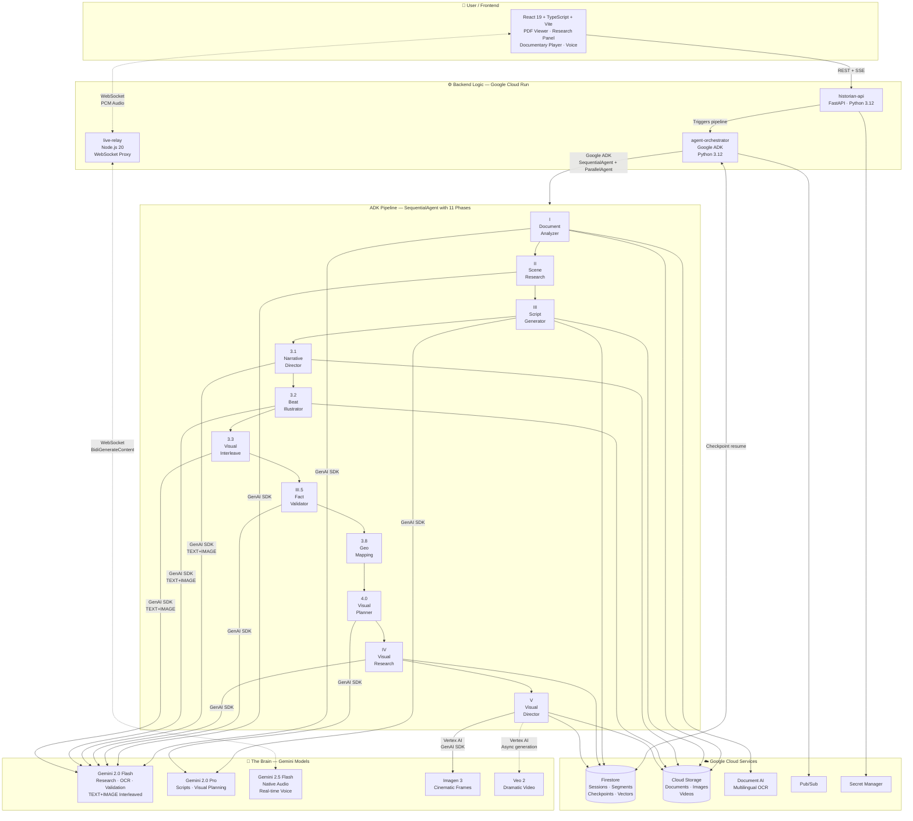

<div align="center">


*Logo generated with Gemini [Chat Link](https://gemini.google.com/share/a34bad9c7dd0)*

# AI Historian

**Upload any historical document. Watch it become a cinematic documentary in under 45 seconds.**

*Real-time multimodal research · Generative cinematic visuals · Always-on live voice historian*

[](https://geminiliveagentchallenge.devpost.com/)
[](https://google.github.io/adk-docs/)
[](https://cloud.google.com/run)
[](https://react.dev/)
[](https://python.org/)
[](LICENSE)

</div>

---

## What is AI Historian?

AI Historian is a real-time multimodal research and documentary engine. Drop any historical document — PDF, scanned manuscript, ancient script — and an 11-phase ADK pipeline immediately begins researching it in parallel. Within 45 seconds the first segment is playable: cinematic imagery, AI narration, and a live historian persona you can interrupt mid-sentence.

| Dimension | What it does |
|---|---|
| **Input** | Any document — PDF, image, multilingual, including dead scripts |
| **Research** | 11-phase ADK pipeline with Google Search grounding, Wikipedia, and Gemini multimodal evaluation |
| **Interleaved Output** | Gemini generates TEXT+IMAGE in a single call — narration direction and storyboard illustrations produced together, not sequentially. Three pipeline phases (3.1, 3.2, 3.3) use `response_modalities=["TEXT","IMAGE"]` |
| **Output** | Self-generating documentary: Gemini interleaved illustrations · Imagen 3 cinematic frames · Veo 2 video · AI narration |
| **Voice** | Gemini 2.5 Flash Native Audio — always listening, responds in < 300ms, resumes after interruption |
| **Grounding** | Every spoken question retrieves the 4 most relevant source passages via Firestore vector search — the historian cites actual document pages, not just scripted narration |
| **Live Illustration** | User questions during the documentary trigger on-the-fly Imagen 3 illustrations with cinematic crossfade |
| **Timeline Map** | Interactive antique-style map with animated pins, routes, and fly-to transitions for each documentary segment |
| **Historian Avatar** | AI-generated oil painting portrait (Gemini image generation) with canvas-based lip sync, blinking, and era-adaptive costumes |
| **Adaptation** | Documentary branches based on your questions — no two sessions are identical |
| **Light / Dark** | Full theme support across all screens including the cinematic player with antique map styles |

---

## Demo

> *Upload an Ottoman firman → watch the Expedition Log fill in real time → speak to the historian mid-documentary*

**[▶ Watch the 4-minute demo](#)** · **[Live deployment](#)**

---

## Architecture



> **How to read this diagram:** The user uploads a document through the React frontend. The `historian-api` triggers the `agent-orchestrator`, which runs an 11-phase ADK pipeline. Phases 3.1–3.3 use Gemini's native interleaved `TEXT+IMAGE` output to generate narration direction and illustrations in a single call. Each phase calls Gemini models via the **Google GenAI SDK** (accessed through the **ADK** framework). The `live-relay` service connects the user's voice to the **Gemini Live API** via WebSocket for real-time conversation. All services run on **Google Cloud Run**, with Firestore for state and Cloud Storage for media.

---

## Agent Pipeline — 11 Phases

<details>
<summary><strong>Phase I — Document Analyzer</strong></summary>

1. **OCR** — Google Document AI extracts multilingual text from the uploaded PDF in GCS
2. **Semantic Chunker** — rule-based splitter: page breaks → headings → topic shifts → 3,200-char fallback
3. **Parallel Summarizer** — `asyncio.gather` + `Semaphore(10)` sends every chunk to Gemini 2.0 Flash concurrently
4. **Narrative Curator** — ADK Agent (Gemini 2.0 Pro) selects 4–8 cinematically compelling scenes and produces structured `SceneBrief` objects and the Visual Bible style guide

**Outputs:** `scene_briefs`, `visual_bible`, `document_map`, `gcs_ocr_path`

5. **Background Embedding** — after chunks are written to Firestore, their summaries are batch-embedded with `gemini-embedding-2-preview` (768 dims, `RETRIEVAL_DOCUMENT` task type) as a background `asyncio.Task`. Phase II starts immediately — vectors are written concurrently without blocking the pipeline. Failures on individual chunks are skipped so a bad chunk never aborts the batch.

</details>

<details>
<summary><strong>Phase II — Scene Research + Aggregator</strong></summary>

- **`ParallelAgent`** spins up one `google_search`-only ADK Agent per scene brief (ADK constraint: `google_search` cannot be combined with other tools)
- Each agent writes `research_{i}` to session state with sources, accepted/rejected evaluation, facts, and a visual prompt
- **Aggregator Agent** merges all `research_0…N` into deduplicated unified facts, source citations, contradiction flags, and an enriched Visual Bible

**Outputs:** `research_0…N`, `aggregated_research`

</details>

<details>
<summary><strong>Phase III — Script Orchestrator</strong></summary>

- Gemini 2.0 Pro generates one `SegmentScript` per scene brief — narration (60–120s), 4 visual frame descriptions, Veo 2 scene, mood, and sources
- All segments are written to Firestore in a single **`WriteBatch`** commit (4–8 sequential round-trips → 1 atomic operation)
- Emits `segment_update(status="generating")` SSE per segment so frontend skeleton cards appear immediately

**Outputs:** `SegmentScript` list in Firestore + `session.state["script"]`

</details>

<details>
<summary><strong>Phase 3.1 — Narrative Director (Gemini Interleaved TEXT+IMAGE)</strong></summary>

- Uses Gemini 2.0 Flash with `response_modalities=["TEXT","IMAGE"]` — a single call per scene produces **both** a creative direction note (text) and a storyboard illustration (image) in one unified reasoning pass
- This is the project's primary implementation of Gemini's native interleaved output: the model acts as creative director, generating visuals and narration direction simultaneously
- Storyboard images are uploaded to GCS and serve as cinematic reference for Phase V's Imagen 3 frames
- Emits `storyboard_scene_start`, `storyboard_text_chunk`, and `storyboard_image_ready` SSE events for live frontend updates

**Outputs:** `storyboard_images` (dict of scene_id → GCS URIs)

</details>

<details>
<summary><strong>Phase 3.2 — Beat Illustration Agent (Interleaved TEXT+IMAGE for Player)</strong></summary>

- Pre-generates narration beats with Gemini's interleaved output (`response_modalities=["TEXT","IMAGE"]`) during the pipeline, so the documentary player has beat images ready **before** playback begins
- Each segment script is decomposed into 3–4 dramatic beats; each beat gets a narration direction + cinematic illustration from a single Gemini call
- Beat 0 is emitted immediately (fast path); beats 1–N are generated concurrently via `asyncio.gather`
- Beat images are the **primary visual path** for the documentary player — Imagen 3 frames from Phase V serve as cinematic fallback
- Emits `narration_beat` SSE events per beat for progressive frontend loading

**Outputs:** `beats` (dict of segment_id → list of beat dicts with GCS image URIs)

</details>

<details>
<summary><strong>Phase 3.3 — Visual Interleave Agent (Beat Visual Type Assignment)</strong></summary>

- Reads beat data from Phase 3.2 and assigns each beat a `visual_type` using Gemini 2.0 Flash:
  - `illustration` — keep the Phase 3.2 Gemini TEXT+IMAGE (no extra generation needed)
  - `cinematic` — generate an Imagen 3 photorealistic frame in Phase V
  - `video` — generate a Veo 2 short clip in Phase V
- This creates a **mixed-modality playback sequence** where illustrations, photographs, and video clips alternate based on narrative pacing
- Phase V reads the `beat_visual_plan` to determine which generation path to use per beat

**Output:** `beat_visual_plan` (dict of segment_id → list of BeatVisualAssignment dicts)

</details>

<details>
<summary><strong>Phase III.5 — Fact Validator (Hallucination Firewall)</strong></summary>

- Gemini 2.0 Flash acts as an LLM-judge, cross-referencing every narration claim against the aggregated research
- Claims are classified: `SUPPORTED` (keep) · `UNSUPPORTED_SPECIFIC` (remove + bridge sentence) · `UNSUPPORTED_PLAUSIBLE` (soften with "according to tradition") · `NON_FACTUAL` (keep, skip)
- Overwrites `session.state["script"]` in place — zero changes to downstream agents
- Latency: ~3–5s; eliminates hallucinated dates, names, and events from narration

</details>

<details>
<summary><strong>Phase 3.8 — Geographic Mapping</strong></summary>

- Extracts geographic locations from scripts and scene briefs, geocodes via Gemini 2.0 Flash with Google Maps grounding
- Writes `SegmentGeo` data to Firestore and emits `geo_update` SSE events for the frontend timeline map
- Enables the interactive antique-style map with animated pins, routes, and fly-to transitions per segment

**Output:** `SegmentGeo` per segment in Firestore

</details>

<details>
<summary><strong>Phase 4.0 — Narrative Visual Planner</strong></summary>

- Single Gemini 2.0 Pro call produces a `VisualStoryboard` — per-scene primary subjects, objects to avoid (anachronism guards), 3–5 targeted image search queries, and 4 frame concepts with composition notes
- Feeds Phase IV with specific search targets instead of generic scene descriptions

**Output:** `visual_storyboard` (VisualStoryboard model)

</details>

<details>
<summary><strong>Phase IV — Visual Research Orchestrator</strong></summary>

6-stage micro-pipeline per scene, all direct `client.aio.models.generate_content` calls (no ADK sub-agents):

| Stage | What it does |
|---|---|
| 0 | Query generation — produces 5–7 targeted image search queries from storyboard |
| 1 | Web search with Google Search grounding — extracts `grounding_chunks[].web.uri` URLs |
| 2 | Source typing — classifies each URL as webpage / Wikipedia / PDF / image |
| 3 | Content fetch — httpx + BeautifulSoup (web) · Wikipedia REST API · Document AI inline (PDF) · Gemini multimodal FileData (image) |
| 4 | Source evaluation — accepts/rejects each source against the scene brief; emits `agent_source_evaluation` SSE |
| 5 | Detail synthesis — merges accepted sources into `VisualDetailManifest` with period-accurate Imagen prompts |

Fast path (Scene 0): 3 sources, early exit at 2 accepted — prioritizes first segment playability.

**Output:** `VisualDetailManifest` per scene in Firestore

</details>

<details>
<summary><strong>Phase V — Visual Director</strong></summary>

- **Beat-aware generation** — reads Phase 3.3's `beat_visual_plan` to determine which path to use per beat:
  - `illustration` beats already have Gemini-generated images from Phase 3.2 — no extra work
  - `cinematic` beats get Imagen 3 photorealistic frames
  - `video` beats get Veo 2 short clips
- **Imagen 3** (`imagen-3.0-fast-generate-001`): generates frames only for `cinematic` beats, all scenes concurrent via `asyncio.gather`. Priority: enriched manifest → storyboard reference → script visual_descriptions → generic fallback. Prompts include era markers as negative prompts.
- **Veo 2** (`veo-2.0-generate-001`): generates clips only for `video` beats, fired async after all Imagen generation completes. Polled with `loop.run_in_executor(None, client.operations.get, op)` (sync-only API).
- **GCS uploads** use a module-level `storage.Client()` singleton and cached `Bucket` reference — eliminates per-upload HTTP connection pool creation.
- Updates Firestore with `imageUrls[]` and `videoUrl` per segment and emits `segment_update(status="complete")` SSE.

**Progressive delivery:** Scene 0 generates images first (before remaining scenes start) to hit the < 45s first-segment target.

</details>

<details>
<summary><strong>Pipeline Executors — Batch and Streaming</strong></summary>

Two pipeline execution modes:

- **`ResumablePipelineAgent`** (batch mode) — every completed phase is checkpointed to Firestore (`/sessions/{id}/checkpoints/pipeline`). On restart after crash or timeout, completed phases are skipped and `session.state` is restored from the snapshot. The pipeline resumes from the first incomplete phase — no reprocessing of OCR, research, or scripts.

- **`StreamingPipelineAgent`** (streaming mode) — runs global phases (I + II) once, then processes per-segment in parallel. Each segment flows through Phases III → 3.1 → 3.2 → 3.3 → V independently, enabling faster first-segment delivery and progressive playback.

</details>

---

## Live Historian Grounding (RAG)

The live historian persona has semantic access to the actual source document — not just the scripted narration — via a lightweight RAG layer that runs entirely on the voice hot path.

**How it works:**

```
User speaks → Gemini Live → inputTranscript event
                                    ↓
                         live-relay intercepts (>15 chars)
                                    ↓
                    POST /api/session/{id}/retrieve  (1.5s timeout)
                                    ↓
               historian-api embeds query (gemini-embedding-2-preview)
               Firestore find_nearest() → top-4 chunks by cosine distance
                                    ↓
              live-relay injects passages as clientContent turn
              before the historian's audio response arrives
```

**Best-effort at every step — nothing can break the voice session:**

| Layer | Failure mode | Behavior |
|---|---|---|
| Background embed task | Exception in `_embed_and_write_background` | Caught and logged — Phase II unaffected |
| Individual chunk | `embed_content` API error | Chunk `embedding` stays `None`, skipped |
| Retrieve endpoint | Any exception | Returns `{"chunks": []}` — never HTTP 500 |
| live-relay injection | Timeout (>1.5s) or network error | `retrieveContext` returns `""` — injection skipped |
| Historian response | No context injected | Answers from existing session context as before |

**Firestore vector index** (one-time setup, 5–15 min to provision):

```bash
gcloud firestore indexes composite create \
  --collection-group=chunks \
  --query-scope=COLLECTION \
  --field-config field-path=embedding,vector-config='{"dimension":"768","flat":"{}"}' \
  --database="(default)" \
  --project=$GCP_PROJECT_ID
```

---

## Tech Stack

### AI Models

| Model | Role |
|---|---|
| `gemini-2.5-flash-native-audio-preview-12-2025` | Historian persona — Gemini Live API |
| `gemini-2.0-pro` | Script generation, Visual Planner, Narrative Curator |
| `gemini-2.0-flash` | Scan Agent, Research Subagents, Fact Validator, Visual Research, Interleaved TEXT+IMAGE (Phases 3.1, 3.2, 3.3), Geo Mapping |
| `gemini-embedding-2-preview` | Chunk summary embeddings (768 dims) + query embedding for RAG retrieval |
| `imagen-3.0-fast-generate-001` | Scene images (4 frames per segment, ~5s each) |
| `veo-2.0-generate-001` | Dramatic video clips (async, 1–2 min each) |

### Google Cloud Services

| Service | Role |
|---|---|
| **Cloud Run** | All three backend services — historian-api, agent-orchestrator, live-relay |
| **Vertex AI** | Imagen 3, Veo 2, Gemini model hosting |
| **Gemini Live API** | Real-time bidirectional voice with interruption and resumption |
| **Firestore** | Session state, agent logs, segments, manifests, phase checkpoints; chunk `Vector(768)` fields for RAG vector search |
| **Cloud Storage** | Uploaded documents, generated images, MP4 videos |
| **Document AI** | Multilingual OCR (`OCR_PROCESSOR`) |
| **Pub/Sub** | Async agent event messaging |
| **Secret Manager** | API keys and service credentials |
| **Artifact Registry** | Docker images for Cloud Run |

### Frontend

| Package | Version | Role |
|---|---|---|
| React | 19 | UI framework — concurrent rendering, `startTransition` for SSE |
| Vite | 6 | Build tool — ESBuild transforms, instant HMR |
| TypeScript | 5.x strict | Full type safety, no `any` |
| Tailwind CSS | v4 | CSS-first config, Lightning CSS engine |
| Zustand | 5 | Client state — `useShallow` selectors, sessionStorage persistence |
| Motion | 12 | All animations — springs, `AnimatePresence`, `layoutId` |
| TanStack Query | v5 | Server state — REST polling, SSE stream management |
| MapLibre GL | 5.x | Interactive antique-style timeline map with animated pins and routes |
| Canvas API | native | Living Portrait avatar — layered canvas compositing with lip sync |
| Radix UI | latest | Accessible headless components — Dialog, Tooltip, Collapsible |
| react-resizable-panels | 4.x | Draggable split layout for PDF viewer + research panel |
| Sonner | 2.x | Toast notifications — `toast.promise()` for async agent operations |
| pdfjs-dist | latest | PDF rendering with text layer extraction |

---

## Performance

| Layer | Optimization | Impact |
|---|---|---|
| Frontend | `React.memo` on AgentCard + SegmentCard; `useShallow` Zustand selectors; `useMemo` for agent grouping | No cascading re-renders on agent status updates |
| Frontend | SSE adaptive drip — 1 / 3 / 8 events per 150ms tick, single `startTransition` per batch | 50-event burst: 7.5s → ~1s catch-up |
| Frontend | Canvas resize guard in Waveform — conditional `width`/`height` assignment | Eliminates 60 GPU context flushes/second during audio |
| Frontend | All pages lazy-loaded via `React.lazy` + `Suspense` | Smaller initial bundle — only UploadPage parsed on first load |
| Frontend | CSS containment (`contain: layout style paint`) + GPU hints (`will-change`) on player and map | Isolates repaint scope; prevents layout thrashing |
| Frontend | ResearchStore persisted to `sessionStorage` via Zustand persist middleware | State survives page refreshes without re-fetching |
| Backend | Firestore `WriteBatch` for segment writes | 4–8 sequential round-trips → 1 atomic commit |
| Backend | `GlobalRateLimiter.locked()` + Retry-After header extraction | Correct backoff without hitting 429 cascades |
| Backend | GCS `storage.Client()` singleton + `Bucket` cache | Eliminates per-upload connection pool creation under concurrent Imagen 3 |
| Backend | Test mode: 6-chunk limit + 1 frame/segment + no Veo 2 | Fast iteration without burning Imagen/Veo quota |

### Performance Targets

| Metric | Target |
|---|---|
| First segment playable | < 45 seconds from document upload |
| Voice interruption latency | < 300ms (historian stops mid-word) |
| Historian response start | < 1.5 seconds after user speech ends |
| Research subagent completion | < 30 seconds per agent |
| Imagen 3 fast generation | ~5 seconds per image |
| Frontend initial bundle | < 200KB gzipped |
| Animation frame budget | 60fps maintained |

---

## Setup

### Prerequisites

- Google Cloud project with billing enabled
- `gcloud` CLI authenticated: `gcloud auth application-default login`
- Terraform ≥ 1.6
- Docker
- Node.js 20, Python 3.12, `pnpm`

### 1. Clone and configure

```bash
git clone https://github.com/pancodo/gemini-live-agent-challenge
cd gemini-live-agent-challenge
cp backend/.env.example backend/.env
# Fill in: GCP_PROJECT_ID, GCS_BUCKET_NAME, DOCUMENT_AI_PROCESSOR_NAME
```

### 2. Provision infrastructure

```bash
cd terraform
terraform init
terraform apply \
  -var="project_id=YOUR_PROJECT_ID" \
  -var="gemini_api_key=YOUR_GEMINI_API_KEY"
```

Provisions: Firestore, GCS buckets (docs + assets), Pub/Sub, Secret Manager, Artifact Registry, 3 Cloud Run services, service account with all IAM roles.

### 3. Build and push images

```bash
PROJECT_ID=YOUR_PROJECT_ID
REGION=us-central1
REGISTRY=${REGION}-docker.pkg.dev/${PROJECT_ID}/historian

gcloud auth configure-docker ${REGION}-docker.pkg.dev

docker build -t ${REGISTRY}/historian-api:latest     backend/historian_api/    && docker push ${REGISTRY}/historian-api:latest
docker build -t ${REGISTRY}/agent-orchestrator:latest backend/agent_orchestrator/ && docker push ${REGISTRY}/agent-orchestrator:latest
docker build -t ${REGISTRY}/live-relay:latest         backend/live_relay/        && docker push ${REGISTRY}/live-relay:latest
```

### 4. Configure secrets and frontend

```bash
# Set Document AI processor
echo -n "projects/YOUR_PROJECT/locations/us/processors/YOUR_PROCESSOR_ID" | \
  gcloud secrets versions add document-ai-processor-name --data-file=-

# Get service URLs
terraform output historian_api_url   # → VITE_API_BASE_URL
terraform output live_relay_url      # → VITE_RELAY_URL

# Run frontend
cd frontend
pnpm install
echo "VITE_API_BASE_URL=https://YOUR_API_URL" > .env.local
pnpm dev
```

### Local development (no Docker)

```bash
# Backend
cd backend
pip install google-adk google-genai google-cloud-documentai \
            google-cloud-firestore google-cloud-storage fastapi uvicorn pydantic
./start.sh --reload

# Frontend (separate terminal)
cd frontend && pnpm install && pnpm dev
```

---

## Project Structure

```
/
├── terraform/
│   └── main.tf                         18 resource types — full GCP provisioning
│
├── frontend/
│   └── src/
│       ├── components/
│       │   ├── upload/                 DropZone, FormatBadge, PersonaSelector
│       │   ├── workspace/              WorkspaceLayout, PDFViewer, ResearchPanel,
│       │   │                           HistorianPanel, AgentModal, SegmentCard,
│       │   │                           ExpeditionLog, StoryboardStream, TopNav
│       │   ├── player/                 DocumentaryPlayer, KenBurnsStage, TimelineMap,
│       │   │                           CaptionTrack, PlayerSidebar, IrisOverlay,
│       │   │                           SourcePanel, ShareButton, BranchTree
│       │   ├── voice/                  VoiceButton, Waveform, VoiceLayer, LiveToast,
│       │   │                           LivingPortrait (canvas)
│       │   └── ui/                     Button, InkButton, Badge, Spinner, Modal,
│       │                               VisualSourceBadge
│       ├── hooks/
│       │   ├── useSSE.ts               Adaptive drip SSE — 1/3/8 events per 150ms tick
│       │   ├── useGeminiLive.ts        WebSocket session lifecycle + text messages
│       │   ├── useAudioCapture.ts      Mic → 16kHz PCM via AudioWorklet
│       │   ├── useAudioPlayback.ts     PCM chunk queue → Web Audio API
│       │   ├── useAudioVisualSync.ts   AnalyserNode → CSS custom properties
│       │   ├── useSegmentGeo.ts        Geo extraction via Gemini Flash for timeline map
│       │   ├── usePortraitRenderer.ts   Canvas compositing engine for Living Portrait
│       │   ├── useLipSync.ts           AnalyserNode frequency → mouth energy computation
│       │   ├── useTextScramble.ts      Cipher/decode title reveal animation
│       │   └── useVoiceState.ts        Voice button state machine with auto-reconnect
│       ├── store/                      sessionStore · researchStore (sessionStorage) · voiceStore · playerStore
│       ├── services/                   api.ts · upload.ts (GCS signed URL)
│       ├── styles/                     map-style.json · map-style-light.json · timeline-map.css
│       └── pages/                      LandingPage · UploadPage · WorkspacePage · PlayerPage ·
│                                       InterleavedDemoPage (lazy-loaded)
│
├── backend/
│   ├── historian_api/
│   │   └── routes/
│   │       ├── session.py              Session lifecycle, SSE stream, signed URL refresh
│   │       ├── pipeline.py             Pipeline trigger, segment endpoints
│   │       ├── retrieve.py             POST /api/session/{id}/retrieve — RAG vector search
│   │       ├── illustrate.py           POST /api/session/{id}/illustrate — live Imagen 3 on user questions
│   │       ├── narrate.py              POST /api/session/{id}/segment/{segId}/narrate — beat-driven interleaved narration
│   │       └── demo_interleaved.py     GET /api/demo/interleaved — standalone TEXT+IMAGE demo
│   ├── agent_orchestrator/
│   │   └── agents/
│   │       ├── pipeline.py             ResumablePipelineAgent + StreamingPipelineAgent
│   │       ├── document_analyzer.py    Phase I — OCR, chunking, summarization, curation
│   │       ├── scene_research_agent.py Phase II — ParallelAgent scene research
│   │       ├── script_agent_orchestrator.py  Phase III — script gen + WriteBatch
│   │       ├── narrative_director_agent.py   Phase 3.1 — Gemini TEXT+IMAGE storyboard
│   │       ├── beat_illustration_agent.py    Phase 3.2 — TEXT+IMAGE player beats
│   │       ├── visual_interleave_agent.py    Phase 3.3 — beat visual_type assignment
│   │       ├── fact_validator_agent.py Phase III.5 — hallucination firewall
│   │       ├── geo_location_agent.py   Phase 3.8 — geographic mapping + geocoding
│   │       ├── narrative_visual_planner.py   Phase 4.0 — VisualStoryboard
│   │       ├── visual_research_orchestrator.py Phase IV — 6-stage visual research
│   │       ├── visual_director_orchestrator.py Phase V — beat-aware Imagen 3 + Veo 2
│   │       ├── branch_pipeline.py      Branching documentary graph from user questions
│   │       ├── entity_extractor.py     Named entity extraction for PDF highlights
│   │       ├── research_deduplicator.py Source deduplication across scenes
│   │       ├── prompt_style_helpers.py Visual prompt styling and era markers
│   │       ├── checkpoint_helpers.py   Phase checkpoint load/save (Firestore)
│   │       ├── rate_limiter.py         GlobalRateLimiter + Retry-After backoff
│   │       ├── sse_helpers.py          SSE event builders
│   │       ├── chunk_types.py          ChunkRecord · SceneBrief · DocumentMap
│   │       ├── script_types.py         SegmentScript
│   │       ├── storyboard_types.py     VisualStoryboard
│   │       ├── visual_detail_types.py  VisualDetailManifest
│   │       ├── visual_interleave_types.py BeatVisualAssignment
│   │       └── geo_types.py            SegmentGeo
│   └── live_relay/                     Node.js 20 WebSocket proxy → Gemini Live API
│                                       + RAG injection · transcript forwarding · Firestore context
│
└── docs/
    ├── spec/                            Product specs (PRD, SRS, FRONTEND_PLAN, RESOURCES)
    ├── project/                         Tasks, UI improvements, feature backlog
    ├── architecture/                    Diagrams and generator script
    │   ├── architecture-diagram.md      Full + compact Mermaid diagrams
    │   └── architecture-diagram.png     Generated PNG
    ├── demo/                            Demo script and interactive prototype
    │   └── DEMO_SCRIPT.md              7-shot demo video shot list with timing
    ├── blog/                            Blog drafts and posting strategy
    └── plans/                           Dated engineering design documents
```

---

## Team

**Berkay** — Live Voice Layer & Real-Time Interaction
`live-relay` · Gemini Live API · browser audio pipeline (PCM encoding) · interruption handling · voice button state machine · session resumption · RAG context injection · transcript forwarding

**Efe** — Research Pipeline, Agent Visualization & Documentary Engine
ADK 11-phase agent pipeline · Gemini interleaved TEXT+IMAGE (Phases 3.1–3.3) · beat-driven narration engine · Document AI OCR · FastAPI gateway · SSE streaming · documentary player · Research Activity panel · Agent Modal · Timeline Map · Living Portrait avatar · live illustration engine · light/dark theme

---

<div align="center">


Built for the **[Gemini Live Agent Challenge](https://geminiliveagentchallenge.devpost.com/)** by Google · `#GeminiLiveAgentChallenge`

</div>
