# AI Historian -- Architecture Document

> A real-time multimodal research and documentary engine built on Google Cloud and the Gemini model family.

---

## Table of Contents

1. [System Overview](#1-system-overview)
2. [High-Level Architecture](#2-high-level-architecture)
3. [ADK Agent Pipeline -- 11 Phases](#3-adk-agent-pipeline--11-phases)
4. [Live Voice System](#4-live-voice-system)
5. [SSE Event Stream](#5-sse-event-stream)
6. [Frontend Data Flow](#6-frontend-data-flow)
7. [Data Persistence](#7-data-persistence)
8. [Infrastructure and Deployment](#8-infrastructure-and-deployment)
9. [Performance Targets](#9-performance-targets)

---

## 1. System Overview

**AI Historian** is a real-time multimodal research and documentary engine. A user uploads any historical document -- a scanned manuscript, a declassified PDF, an ancient text in any language including dead scripts -- and the system immediately begins parallel AI research while the user reads the document. That research feeds a generative documentary pipeline producing cinematic visuals (Imagen 3 + Veo 2), narration, and a living historian persona the user can speak to and interrupt at any moment, mid-playback. No two sessions produce the same documentary.

### What Makes It Unique

AI Historian is the first system to combine four capabilities in a single seamless flow:

| Capability | Implementation |
|---|---|
| **Live multilingual OCR** | Document AI processes any script -- Latin, Arabic, Cyrillic, CJK, Ottoman Turkish, Ancient Greek -- and feeds structured text to the pipeline |
| **Parallel AI research with grounding** | An ADK ParallelAgent fans out N google_search-equipped agents simultaneously, each refining queries three times against live web sources |
| **Generative cinematic visuals** | Imagen 3 produces historically-researched still frames; Veo 2 generates dramatic video clips; Gemini TEXT+IMAGE interleaving creates storyboard illustrations -- all driven by a 6-stage visual research micro-pipeline |
| **Always-on live voice persona** | A Gemini 2.5 Flash Native Audio historian speaks, listens, and converses in real time over WebSocket. The user interrupts mid-sentence and the historian responds in under 300ms |

These four modalities -- text, image, audio, and video -- are generated simultaneously from a single historical document and interleaved into a coherent narrative experience.

### High-Level Flow

```
Upload Document --> AI Research Pipeline --> Documentary Generation --> Live Voice Conversation
     (any language)     (parallel agents)       (visuals + narration)     (always interruptible)
```

The user's journey moves through three screens:

1. **Upload** -- drag-and-drop any document; the system identifies language and begins OCR
2. **Workspace** -- the user reads the document while watching AI agents research in real time; segments materialize as skeleton cards that fill with content
3. **Player** -- a full-screen cinematic documentary plays with Ken Burns visuals, word-by-word captions, and an always-listening voice button for live conversation with the historian

---

## 2. High-Level Architecture

### System Topology

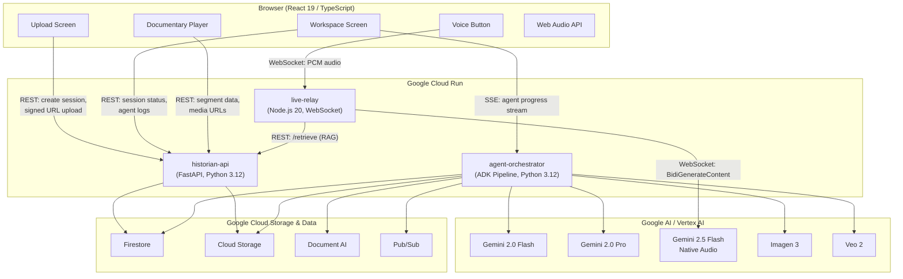

### Three Cloud Run Services

| Service | Runtime | Role | Port | Scaling |
|---|---|---|---|---|
| **historian-api** | Python 3.12, FastAPI | HTTP gateway for the frontend. Handles session creation, signed URL generation for GCS uploads, session status queries, agent log retrieval, segment data serving, and RAG vector search for the live voice system. | 8080 | 0-10 instances, 2 vCPU, 2 GiB |
| **agent-orchestrator** | Python 3.12, ADK | Runs the full 11-phase research and documentary pipeline. Streams progress to the frontend via Server-Sent Events. Calls Gemini, Imagen 3, Veo 2, and Document AI directly. | 8081 | 0-5 instances, 4 vCPU, 4 GiB |
| **live-relay** | Node.js 20 | WebSocket proxy between the browser and the Gemini Live API. Handles audio format translation, session resumption, system instruction assembly, RAG context injection, and live illustration via non-blocking function calls. | 8082 | 0-10 instances, 1 vCPU, 1 GiB |

### Google Cloud Services

| Service | Role | Why This Service |
|---|---|---|
| **Cloud Run** | Hosts all three backend services | Serverless containers with WebSocket support, scale-to-zero, custom runtime |
| **Vertex AI** | Hosts Imagen 3 and Veo 2 model endpoints | Only path to image and video generation models |
| **Firestore** | Session state, agent logs, documentary graph, embeddings for RAG | Real-time listeners, flexible schema, native vector search (find_nearest) |
| **Cloud Storage (GCS)** | Uploaded documents, generated images, MP4 videos, OCR text | Signed URLs for direct browser upload, CDN-compatible serving |
| **Document AI** | Multilingual OCR (OCR_PROCESSOR) | Handles 200+ languages, handwriting, degraded scans, automatic page segmentation |
| **Pub/Sub** | Async event messaging between services | Decouples pipeline events from HTTP request lifecycle |
| **Secret Manager** | API keys, service account credentials | Zero secrets in code or environment variables at build time |
| **Cloud Build** | CI/CD pipeline, Docker image builds | Parallel multi-service builds triggered by git push |
| **Artifact Registry** | Docker image storage | Private container registry co-located with Cloud Run |

---

## 3. ADK Agent Pipeline -- 11 Phases

The documentary generation pipeline is implemented as an ADK **SequentialAgent** containing 11 phases. Each phase is either a custom **BaseAgent** (for complex orchestration logic) or a standard ADK **Agent** (for single-model calls). The pipeline runs inside the `agent-orchestrator` Cloud Run service and streams progress to the frontend via SSE.

### Pipeline Overview

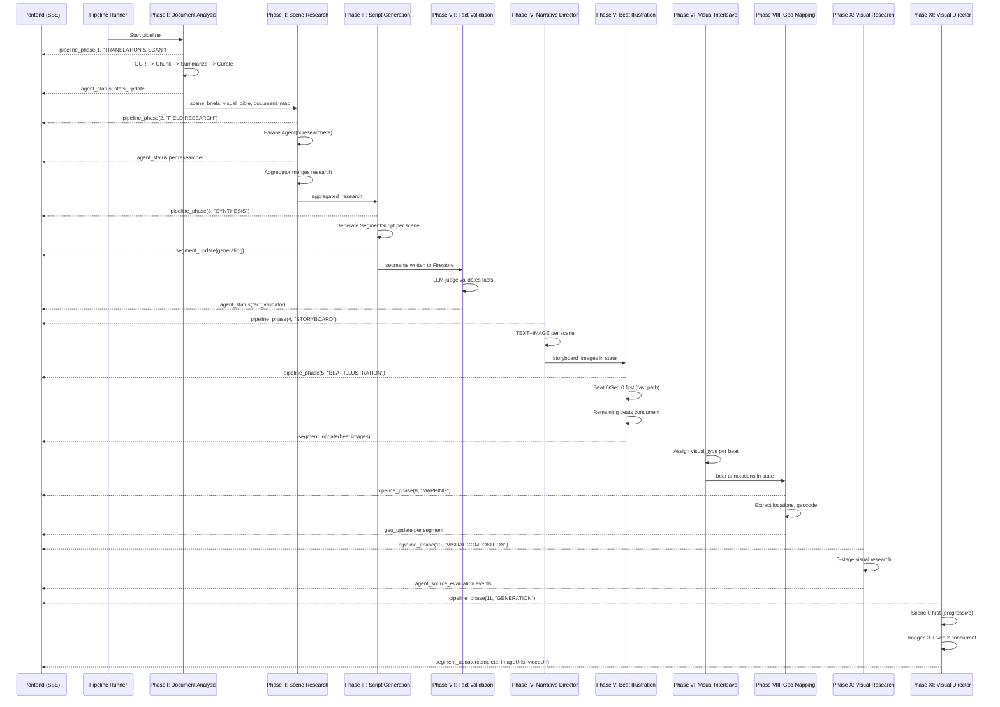

### Two Pipeline Executors

The system provides two execution modes:

| Executor | Class | Behavior |
|---|---|---|
| **ResumablePipelineAgent** | Batch mode | Checkpoint-aware. Runs all 11 phases sequentially with phase-level resume. If the process crashes mid-Phase X, it restarts from Phase X, not Phase I. Used for reliability. |
| **StreamingPipelineAgent** | Streaming mode | Runs global phases (I + II) once, then processes segments in parallel for faster first-segment delivery. Optimizes for time-to-first-playable-segment. |

Both executors use the same phase implementations and SSE emitter protocol.

---

### Phase I: Document Analysis

**File:** `document_analyzer.py`
**Agent Type:** BaseAgent (custom orchestration)
**Model:** Gemini 2.0 Flash (summarization), Gemini 2.0 Pro (narrative curation)

Phase I transforms a raw uploaded document -- in any language, any format -- into a curated set of cinematically compelling scenes ready for research.

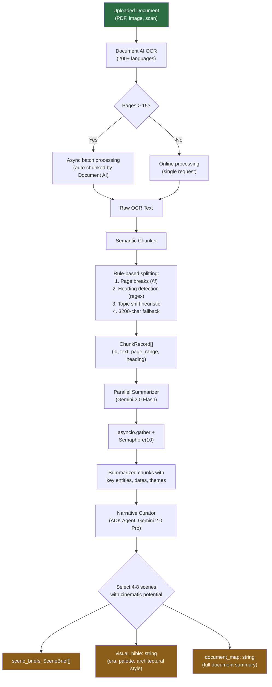

#### Sub-Steps in Detail

**1. Document AI OCR**

The system uses Google Cloud Document AI with the `OCR_PROCESSOR` type. It automatically detects the document language -- no user input required. For documents exceeding 15 pages, it switches to async batch processing where Document AI automatically chunks the PDF into processable segments. The OCR result is stored in GCS as a backup.

**2. Semantic Chunker**

A rule-based chunker splits the raw OCR text into meaningful segments:

- **Page break splitting** -- respects `\f` characters from Document AI
- **Heading detection** -- regex patterns identify section headers (ALL CAPS lines, numbered sections, lines followed by blank lines with short length)
- **Topic shift heuristic** -- when the lexical overlap between consecutive paragraphs drops below a threshold, a new chunk begins
- **3200-character fallback** -- no chunk exceeds this limit to stay within efficient Gemini context windows for summarization

Each chunk becomes a `ChunkRecord` with: `id`, `text`, `page_range`, `heading` (if detected), and `token_estimate`.

**3. Parallel Summarizer**

All chunks are summarized concurrently using Gemini 2.0 Flash. An `asyncio.Semaphore(10)` limits concurrent API calls to avoid rate limiting. Each summarization extracts:

- Key entities (people, places, organizations)
- Dates and time periods
- Central themes and narrative potential
- Connections to other chunks

**4. Narrative Curator**

An ADK Agent powered by Gemini 2.0 Pro receives all chunk summaries and selects 4-8 scenes that form a compelling documentary arc. The curator is instructed to prioritize:

- Dramatic turning points
- Visual richness (scenes that can be illustrated)
- Narrative coherence (the selected scenes should tell a complete story)
- Diverse perspectives within the document

The curator produces three outputs stored in `session.state`:

| Output | Key | Description |
|---|---|---|
| **Scene Briefs** | `scene_briefs` | Array of `SceneBrief` objects, each containing: scene title, time period, key figures, central conflict, source chunk IDs, and research queries |
| **Visual Bible** | `visual_bible` | A prose description of the document's era: architectural styles, clothing, color palettes, lighting conditions, typography. This propagates to every downstream visual generation call. |
| **Document Map** | `document_map` | A structured summary of the entire document for the live voice system's context window |

**SSE Events Emitted:**
- `pipeline_phase` (phase=1, label="TRANSLATION & SCAN")
- `agent_status` (queued/searching/done for OCR, chunker, summarizer, curator)
- `stats_update` (sourcesFound increments as chunks are processed)

---

### Phase II: Scene Research

**File:** `scene_research_agent.py`
**Agent Type:** BaseAgent wrapping an ADK ParallelAgent
**Model:** Gemini 2.0 Flash (N research agents + 1 aggregator)

Phase II fans out N parallel research agents -- one per scene brief -- each equipped with Google Search grounding. This is where the system gathers real-world evidence for every claim the documentary will make.

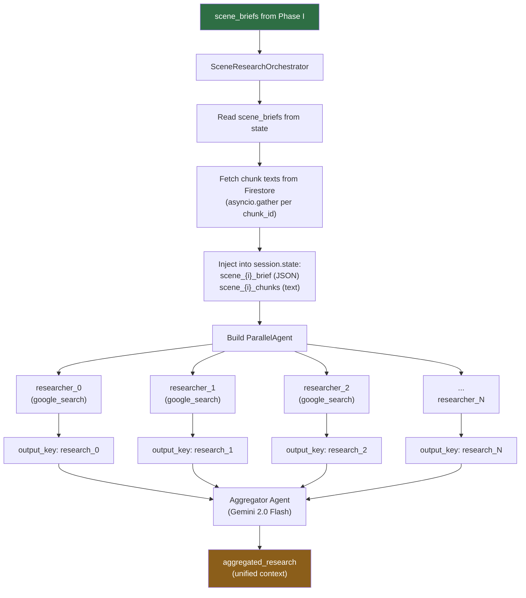

#### ADK Constraint: google_search Isolation

A critical ADK limitation shapes this architecture: **the `google_search` tool cannot be combined with other tools in the same agent**. Each research agent is therefore a pure search agent -- it can only call `google_search` and produce text output. All post-processing, merging, and evaluation happens in separate agents.

#### Research Agent Behavior

Each research agent receives:

- The scene brief (title, time period, key figures, central conflict)
- The original chunk text from the document
- Three progressively refined search queries generated from the brief

The agent performs three search rounds:

1. **Broad context search** -- establishes the historical period and key events
2. **Specific entity search** -- targets named people, places, and organizations
3. **Visual reference search** -- finds descriptions of architecture, clothing, landscapes relevant to the scene

Each agent writes its findings to `session.state[f"research_{i}"]` via the ADK `output_key` mechanism.

#### Aggregator

After the ParallelAgent completes, the aggregator agent reads all `research_0` through `research_N` state keys and produces a unified `aggregated_research` document. The aggregator:

- Deduplicates overlapping findings
- Cross-references facts across scenes
- Flags contradictions for the fact validator
- Structures the research by scene for downstream consumption

**SSE Events Emitted:**
- `pipeline_phase` (phase=2, label="FIELD RESEARCH")
- `agent_status` per researcher (queued/searching/done)
- `stats_update` (sourcesFound increments per search result)

---

### Phase III: Script Generation

**File:** `script_agent_orchestrator.py`
**Agent Type:** BaseAgent wrapping an ADK Agent
**Model:** Gemini 2.0 Pro

Phase III transforms raw research into a structured documentary script. Each scene becomes a `SegmentScript` -- a complete production blueprint containing narration text, visual directions, and source citations.

#### SegmentScript Schema

```
SegmentScript:
  id:                   string    -- unique segment identifier
  scene_id:             int       -- maps back to scene_brief index
  title:                string    -- segment display title
  narration_script:     string    -- 60-120 seconds of spoken narration
  visual_descriptions:  string[]  -- 4 Imagen 3 prompt descriptions
  veo2_scene:           string    -- single Veo 2 video prompt
  mood:                 string    -- emotional tone (reverent, tense, triumphant...)
  narrative_role:        string    -- position in documentary arc
  sources:              string[]  -- URLs and citations from research
```

#### Generation Flow

1. The `ScriptAgentOrchestrator` emits `pipeline_phase(3, "SYNTHESIS")` and `agent_status(queued)`
2. An inner ADK Agent (Gemini 2.0 Pro) receives `scene_briefs` and `aggregated_research` via session state template variables
3. The agent generates a JSON array of `SegmentScript` objects
4. The orchestrator parses the output (handling both bare arrays and `{"segments":[...]}` envelopes, stripping markdown code fences)
5. Each segment is immediately written to Firestore at `/sessions/{id}/segments/{segmentId}` with stub `imageUrls` and `videoUrl` fields
6. A `segment_update(status="generating")` SSE event fires per segment -- the frontend renders skeleton cards with real titles

**SSE Events Emitted:**
- `pipeline_phase` (phase=3, label="SYNTHESIS")
- `agent_status` (queued/searching/done)
- `segment_update` (status="generating", with title and mood)
- `stats_update` (segmentsReady increments)

---

### Phase VII: Fact Validation

**File:** `fact_validator_agent.py`
**Agent Type:** BaseAgent
**Model:** Gemini 2.0 Flash

Phase VII is the **hallucination firewall**. An LLM-judge cross-references every sentence in the narration script against the grounded research from Phase II.

#### Sentence Classification

Each sentence in the narration is classified into one of four categories:

| Classification | Action | Example |
|---|---|---|
| **SUPPORTED** | Keep as-is | "The treaty was signed on June 28, 1919" (confirmed by 3 search results) |
| **UNSUPPORTED SPECIFIC** | Remove entirely | "Exactly 47 delegates attended" (no source confirms this number) |
| **UNSUPPORTED PLAUSIBLE** | Soften language | "The crowd reportedly numbered in the thousands" --> "Contemporary accounts suggest a large crowd gathered" |
| **NON-FACTUAL** | Keep as-is | "The weight of history hung heavy in the air" (narrative prose, not a factual claim) |

The validator overwrites the narration script in place -- downstream phases receive only validated text. This prevents Imagen 3 and Veo 2 from generating visuals for fabricated events.

**SSE Events Emitted:**
- `agent_status` (fact_validator: queued/searching/done)
- `stats_update` (factsVerified increments)

---

### Phase IV: Narrative Director

**File:** `narrative_director_agent.py`
**Agent Type:** BaseAgent
**Model:** Gemini 2.0 Flash with `response_modalities=["TEXT", "IMAGE"]`

Phase IV uses Gemini's native **interleaved TEXT+IMAGE output** -- a single API call produces both creative direction prose and a storyboard illustration. This is a key differentiator: the storyboard images are not generated separately and matched to text; they emerge from the same model call that produces the narrative direction.

#### Per-Scene Process

For each scene, a single Gemini call receives:

- The scene brief
- The validated narration script
- The visual bible

And produces:

- **Creative direction text** -- camera angles, lighting notes, color palette adjustments, emotional beats
- **Storyboard illustration** -- a 1024x1024 image visualizing the scene's key moment

Storyboard images are uploaded to GCS at `gs://{bucket}/sessions/{id}/storyboards/scene_{i}.png` and their URIs stored in `session.state["storyboard_images"]`.

**SSE Events Emitted:**
- `pipeline_phase` (phase=4, label="STORYBOARD")
- `agent_status` per scene

---

### Phase V: Beat Illustration

**File:** `beat_illustration_agent.py`
**Agent Type:** BaseAgent
**Model:** Gemini 2.0 Flash with `response_modalities=["TEXT", "IMAGE"]`

Phase V decomposes each segment's narration into **3-4 dramatic beats** and generates a narration snippet plus a 16:9 illustration for each beat. These beat images are the **primary visual path** in the documentary player -- they are what the viewer sees while the historian narrates.

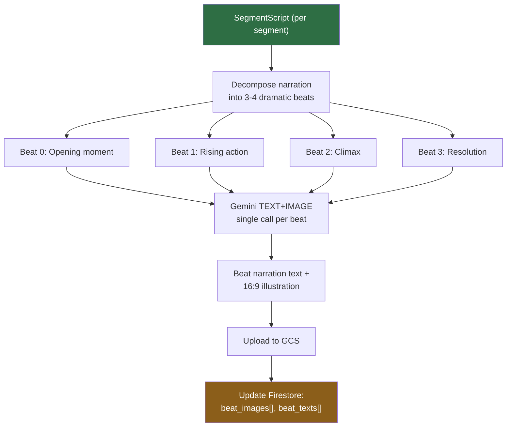

#### Fast Path Strategy

Time-to-first-playable-segment is critical (target: < 45 seconds). Phase V implements a fast path:

1. **Beat 0 of Segment 0** generates first, alone
2. The moment it completes, a `segment_update` SSE event fires -- the frontend can begin playback
3. **All remaining beats** (Beat 1-3 of Segment 0, all beats of Segments 1-N) generate concurrently via `asyncio.gather`

This means the user can start watching the documentary while the rest is still being illustrated.

**SSE Events Emitted:**
- `pipeline_phase` (phase=5, label="BEAT ILLUSTRATION")
- `segment_update` (beat images as they complete)

---

### Phase VI: Visual Interleave

**File:** `visual_interleave_agent.py`
**Agent Type:** BaseAgent
**Model:** Gemini 2.0 Flash

Phase VI assigns each beat a **visual type** that determines how it will be rendered in the final documentary:

| Visual Type | Source | When Used |
|---|---|---|
| `illustration` | Keep the Phase V beat image as-is | Most beats -- the TEXT+IMAGE illustrations are already high quality |
| `cinematic` | Generate a new image via Imagen 3 in Phase XI | Beats requiring photorealistic quality, specific historical accuracy, or complex compositions |
| `video` | Generate a video clip via Veo 2 in Phase XI | Climactic moments, action sequences, or scenes with inherent motion (battles, journeys, ceremonies) |

The assignment is based on:

- The beat's narrative role (opening beats are often `illustration`, climaxes may be `video`)
- Available visual research detail (if Phase X found rich reference material, `cinematic` is preferred)
- Budget constraints (Veo 2 is expensive; typically 1-2 video beats per documentary)

The annotations are written to session state for Phase XI to consume.

---

### Phase VIII: Geographic Mapping

**File:** `geo_location_agent.py`
**Agent Type:** BaseAgent
**Model:** Gemini 2.0 Flash with Google Maps grounding

Phase VIII extracts geographic locations from the narration and produces structured map data for the frontend's timeline map.

#### Process

1. **Location extraction** -- Gemini identifies all place names, regions, and movement paths mentioned in the narration
2. **Geocoding** -- Each location is geocoded using Gemini with Google Maps grounding, producing latitude/longitude coordinates
3. **SegmentGeo construction** -- Per segment, the agent produces:
   - `map_center`: lat/lng for the segment's primary location
   - `zoom`: appropriate map zoom level
   - `events`: array of point events with coordinates, labels, and timestamps
   - `routes`: array of movement paths (for journeys, military campaigns, trade routes)

4. **Persistence** -- SegmentGeo is written to Firestore at `/sessions/{id}/segments/{segmentId}` (merged into existing segment doc) and emitted as a `geo_update` SSE event

The frontend consumes `geo_update` events to render an animated timeline map that tracks the documentary's geographic scope.

**SSE Events Emitted:**
- `pipeline_phase` (phase=8, label="MAPPING")
- `geo_update` per segment (with full SegmentGeo payload)

---

### Phase X: Visual Research

**File:** `visual_research_orchestrator.py`
**Agent Type:** BaseAgent (no ADK sub-agents -- all direct Gemini calls)
**Model:** Gemini 2.0 Flash

Phase X is a 6-stage micro-pipeline that researches the visual details needed to generate historically accurate images. Unlike other phases, it uses **no ADK sub-agents** -- all calls are direct `client.aio.models.generate_content` invocations for maximum control over the research flow.

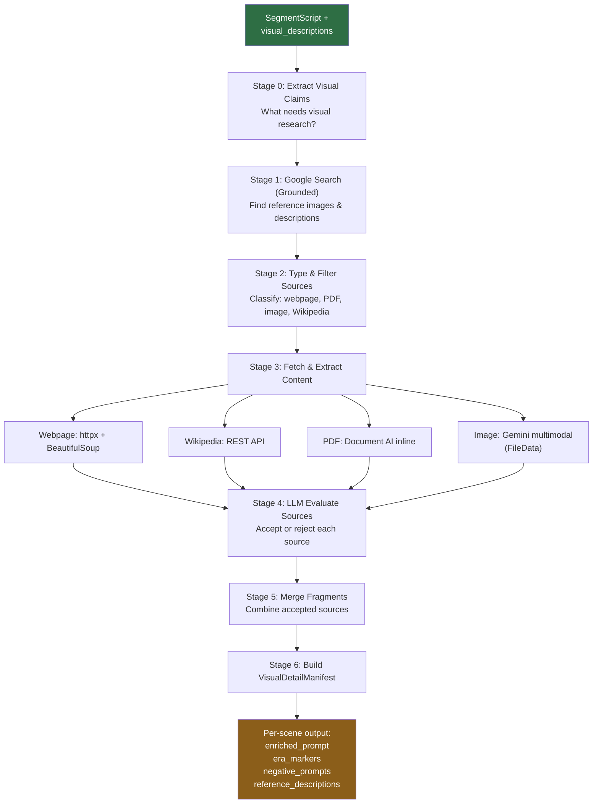

#### Stage Details

| Stage | Function | Input | Output |
|---|---|---|---|
| **0** | `stage_0_extract_claims` | SegmentScript | List of visual claims requiring research (e.g., "Ottoman court dress circa 1453") |
| **1** | `stage_1_grounded_search` | Visual claims | `DiscoveredSource[]` with URLs from `grounding_chunks[].web.uri` |
| **2** | `stage_2_type_sources` | DiscoveredSource[] | `TypedSource[]` classified as webpage / PDF / image / Wikipedia |
| **3** | `stage_3_fetch_content` | TypedSource[] | `FetchedContent[]` -- raw text/image data from each source |
| **4** | `stage_4_evaluate_sources` | FetchedContent[] | `EvaluatedSource[]` -- each source accepted or rejected with rationale |
| **5** | `stage_5_merge_fragments` | Accepted EvaluatedSource[] | `MergedVisualDetail` -- unified visual description |
| **6** | `stage_6_build_manifest` | MergedVisualDetail | `VisualDetailManifest` with enriched_prompt, era_markers, negative_prompts |

#### Fast Path vs Deep Path

| Path | Scenes | Sources Searched | Early Exit |
|---|---|---|---|
| **Fast** | Scene 0 only | 3 sources max | Exits at 2 accepted sources |
| **Deep** | Scenes 1-N | 10 sources max | No early exit |

Scene 0 uses the fast path to minimize time-to-first-playable-segment. The remaining scenes run concurrently via `asyncio.gather` on the deep path while the user may already be watching Segment 0.

#### VisualDetailManifest Schema

```
VisualDetailManifest:
  scene_id:              int
  enriched_prompt:       string     -- Imagen 3-ready prompt with historical detail
  era_markers:           string[]   -- Period-specific visual elements
  negative_prompts:      string[]   -- What to avoid (anachronisms, etc.)
  reference_descriptions: string[]  -- Textual descriptions of reference material
  accepted_sources:      EvaluatedSource[]
  confidence:            float      -- 0.0-1.0 based on source quality
```

The `enriched_prompt` is the primary input to Imagen 3 in Phase XI. It contains far more historical detail than the original `visual_descriptions` from the script -- architectural specifics, fabric textures, lighting conditions, vegetation types -- all grounded in researched sources.

**SSE Events Emitted:**
- `pipeline_phase` (phase=4, label="VISUAL COMPOSITION")
- `agent_status` per scene (queued/searching/done)
- `agent_source_evaluation` (real-time accept/reject events for the frontend's source evaluation shimmer)
- `segment_update` (status="visual_ready")
- `stats_update` (sourcesFound increments)

---

### Phase XI: Visual Director

**File:** `visual_director_orchestrator.py`
**Agent Type:** BaseAgent (no ADK sub-agents -- direct Vertex AI calls)
**Models:** Imagen 3 (`imagen-3.0-fast-generate-001`), Veo 2 (`veo-2.0-generate-001`)

Phase XI is the final generation phase. It produces the actual images and videos that compose the documentary, using the beat annotations from Phase VI and the visual research from Phase X.

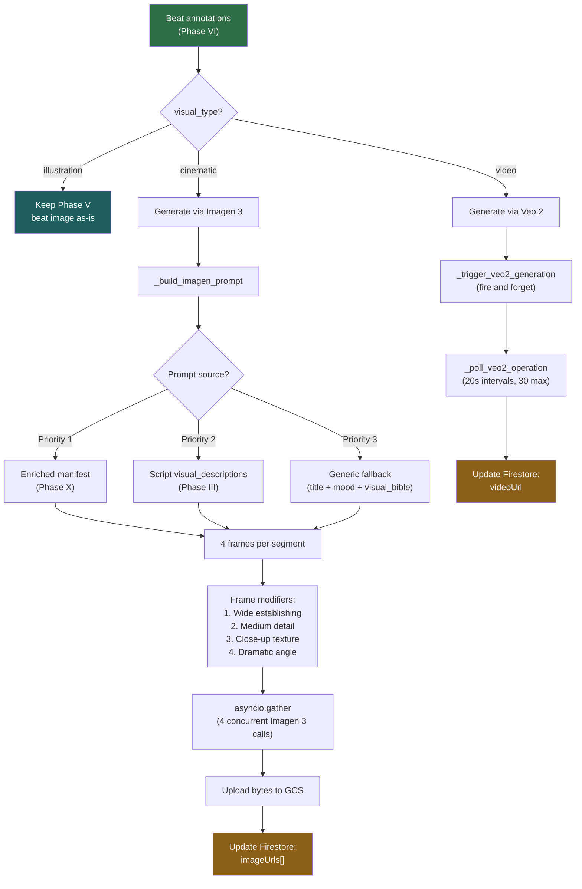

#### Imagen 3 Prompt Construction

The `_build_imagen_prompt` method follows a strict priority hierarchy:

1. **Enriched manifest** (Phase X) -- Contains historically-researched visual details: "Hagia Sophia interior, 1453, with Ottoman military banners draped over Byzantine mosaics, filtered sunlight through clerestory windows, dust motes visible in light shafts"
2. **Script visual_descriptions** (Phase III) -- The original AI-written descriptions: "Interior of a grand cathedral being converted to a mosque"
3. **Generic fallback** -- Constructed from segment title + mood + visual bible: "A reverent scene set in 15th century Constantinople, Ottoman architectural style"

Each segment generates **4 frames** with distinct cinematographic modifiers:

| Frame | Modifier | Lens Spec |
|---|---|---|
| Frame 1 | Wide establishing shot | 24mm, deep focus, golden hour |
| Frame 2 | Medium shot with period detail | 50mm, shallow depth of field |
| Frame 3 | Close-up on texture/artifact | 85mm macro, extreme detail |
| Frame 4 | Dramatic low/high angle | 35mm, Dutch angle or bird's eye |

Additionally, the visual bible's `era_markers` translate to `negative_prompt` entries (e.g., "no modern clothing", "no electric lighting", "no paved roads") and the prompt includes a film stock simulation directive (e.g., "Shot on Kodak Ektachrome, warm grain, period-appropriate color rendition").

#### Progressive Delivery

```
Timeline:
  [0s]     Scene 0 Imagen 3 starts (4 frames)
  [~5s]    Scene 0 complete --> segment_update(complete, imageUrls) --> frontend can play
  [~5s]    Scenes 1-N start concurrently (asyncio.gather)
  [~15s]   All Imagen 3 complete
  [~15s]   Veo 2 operations started (fire and forget)
  [~2min]  Veo 2 polling completes --> segment_update(complete, videoUrl)
```

Scene 0 generates first, alone. The moment its 4 frames are uploaded to GCS, a `segment_update(status="complete")` SSE event fires. The frontend transitions from the Expedition Log loading screen to the documentary player. Remaining scenes generate concurrently while the user watches.

#### Veo 2 Video Generation

Veo 2 operates asynchronously:

1. `_trigger_veo2_generation` calls `client.aio.models.generate_videos` with `output_gcs_uri` -- the API returns a long-running operation handle
2. All Veo 2 operations are collected and polled together after all Imagen 3 work completes
3. `_poll_veo2_operation` checks every 20 seconds, up to 30 times (10-minute timeout)
4. `client.operations.get` is **synchronous only** in the SDK -- calls are wrapped in `loop.run_in_executor(None, client.operations.get, op)` to avoid blocking the event loop
5. On completion, the video URI (`operation.response.generated_videos[0].video.uri`) is written to Firestore and a `segment_update` event fires

**SSE Events Emitted:**
- `pipeline_phase` (phase=5, label="GENERATION")
- `agent_status` per scene (queued/searching/done)
- `segment_update` (status="complete", imageUrls=[...], videoUrl=...)
- `stats_update` (segmentsReady increments)

---

## 4. Live Voice System

The live voice system creates an always-on historian persona that the user can speak to at any moment -- during documentary playback, while browsing research, or on the upload screen. The historian responds with contextual awareness of everything the pipeline has discovered.

### WebSocket Relay Architecture

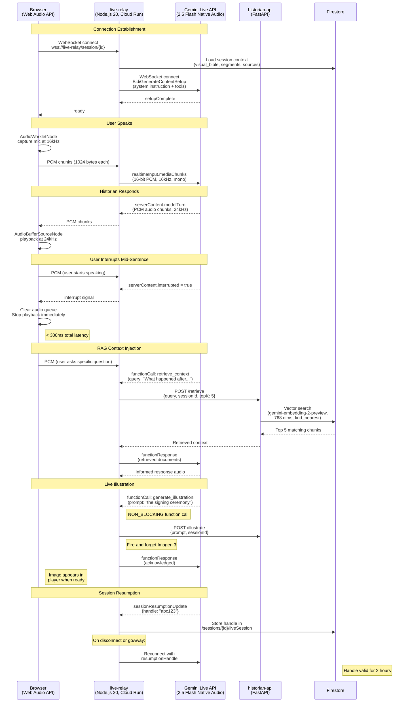

### System Instruction Building

When the live-relay establishes a connection to the Gemini Live API, it assembles a comprehensive system instruction from multiple sources:

| Component | Source | Purpose |
|---|---|---|
| **Persona definition** | Hardcoded template | "You are a distinguished historian..." -- voice, tone, speaking style |
| **Visual bible** | `session.state["visual_bible"]` via Firestore | Era context so the historian speaks knowledgeably about the period |
| **Segment summaries** | `/sessions/{id}/segments/*` from Firestore | Awareness of what the documentary covers |
| **Source citations** | Aggregated from segment sources | Ability to cite specific sources when asked |
| **Current playback state** | Real-time from frontend via WebSocket | Knows which segment is playing, enabling contextual responses |

The system instruction is rebuilt on each connection (including resumptions) to incorporate any new segments that completed while the user was disconnected.

### RAG Pipeline

When the user asks a question that requires specific knowledge beyond what fits in the system instruction, the historian triggers a **retrieve_context** function call:

1. Gemini recognizes the question needs retrieval and calls the `retrieve_context` tool
2. The live-relay forwards the query to `historian-api` at `POST /retrieve`
3. The API embeds the query using `gemini-embedding-2-preview` (768 dimensions)
4. Firestore `find_nearest` performs vector search against pre-embedded document chunks
5. The top 5 results are returned to the live-relay
6. The live-relay sends them as a `functionResponse` to Gemini
7. Gemini incorporates the retrieved context into its spoken response

This RAG pipeline runs in under 500ms, transparent to the user -- they hear a natural pause as the historian "considers" the question.

### Live Illustration

The Gemini Live API supports **NON_BLOCKING function calls** -- the model can request an action without waiting for the result. The historian uses this for spontaneous illustration:

- While narrating, the model may call `generate_illustration(prompt="the ceremonial hall described in the manuscript")` as a non-blocking call
- The live-relay fires off an Imagen 3 generation request to `historian-api` and immediately returns an acknowledgment to Gemini
- The historian continues speaking without pausing
- When the image is ready (~5 seconds), it appears in the documentary player

### Audio Specifications

| Direction | Format | Sample Rate | Bit Depth | Channels | Chunk Size |
|---|---|---|---|---|---|
| **Microphone to Gemini** | Raw PCM | 16,000 Hz | 16-bit signed | Mono | 1024 bytes |
| **Gemini to Speaker** | Raw PCM | 24,000 Hz | 16-bit signed | Mono | Variable |

The browser captures audio via an `AudioWorkletNode` running a custom processor that downsamples to 16kHz and encodes to 16-bit PCM. Playback uses `AudioBufferSourceNode` instances queued in sequence, with a pre-buffer of 3 chunks to prevent gaps.

### Session Resumption

The Gemini Live API has a 15-minute session limit. To provide continuous conversation:

1. The server sends `sessionResumptionUpdate` messages containing a `handle` token
2. The live-relay persists the latest handle to Firestore at `/sessions/{id}/liveSession`
3. On disconnect (network drop, `goAway` signal, or timeout), the relay reconnects using the stored handle
4. Handles are valid for 2 hours
5. `contextWindowCompression.slidingWindow` is enabled to allow sessions to exceed 15 minutes between resumptions

### Interruption Latency

The < 300ms interruption target is achieved through:

- **Server-side VAD** -- Gemini's `automaticActivityDetection` detects user speech on the server, eliminating round-trip for VAD processing
- **Immediate queue flush** -- On receiving `serverContent.interrupted = true`, the browser clears its entire audio buffer queue in a single operation
- **No debounce** -- The interrupt signal is acted on immediately, with no confirmation or debounce delay

---

## 5. SSE Event Stream

The agent-orchestrator streams pipeline progress to the frontend via **Server-Sent Events** at `GET /api/session/{id}/stream`. This creates a real-time window into the AI research process.

### Event Types

| Event Type | Emitting Phase(s) | Payload | Purpose |
|---|---|---|---|
| `pipeline_phase` | All | `{ phase: number, label: string }` | Marks the start of a new pipeline phase. Frontend renders phase headers in the Expedition Log. |
| `agent_status` | All | `{ agentId: string, status: "queued"\|"searching"\|"evaluating"\|"done"\|"error", query?: string }` | Updates individual agent cards. Status transitions drive the 5-state visual machine (dot color, border animation, label). |
| `agent_log` | I, II, X | `{ agentId: string, step: string, detail: string, ts: number }` | Detailed log entries for the Agent Modal. Typewriter-animated at 20ms/char in the Expedition Log. |
| `agent_source_evaluation` | X | `{ agentId: string, sourceUrl: string, verdict: "accepted"\|"rejected", rationale: string }` | Real-time source accept/reject in the Agent Modal. Drives the shimmer-to-reveal animation. |
| `segment_update` | III, V, XI | `{ segmentId: string, sceneId: number, status: string, title?: string, mood?: string, narration_script?: string, image_urls?: string[], video_url?: string }` | Progressive segment card population. Status transitions: generating --> visual_ready --> complete. |
| `geo_update` | VIII | `{ segmentId: string, geo: SegmentGeo }` | Geographic data for the timeline map. Contains center, zoom, events, routes. |
| `stats_update` | All | `{ sourcesFound?: number, factsVerified?: number, segmentsReady?: number }` | Drives the accumulation counter in the Expedition Log stats bar. Gold flash on increment. |
| `pipeline_complete` | XI (final) | `{ sessionId: string }` | Signals the entire pipeline is done. Frontend enables "Watch Documentary" button. |
| `pipeline_error` | Any | `{ phase: number, error: string, recoverable: boolean }` | Error handling. Recoverable errors allow retry; non-recoverable errors show explanation. |

### Frontend SSE Processing

The frontend's `useSSE` hook implements several strategies to handle the high-throughput event stream:

**150ms Drip Buffer**

During parallel phases (II and IV especially), multiple agents emit events simultaneously. Without buffering, the UI would jump erratically. The drip buffer:

1. Incoming SSE events are pushed to a `pendingRef` array
2. A `setInterval` at 150ms shifts one event from the queue and processes it
3. This creates a steady, readable stream of updates regardless of backend burst patterns

**Last-Event-ID Reconnection**

Each SSE event includes an `id` field (monotonically increasing integer). If the connection drops:

1. The browser's native `EventSource` reconnects automatically
2. It sends the `Last-Event-ID` header with the last received ID
3. The backend replays any events the client missed
4. The drip buffer absorbs the replay burst without visual disruption

**Event Deduplication**

On reconnection replays, events may be received twice. The `useSSE` hook maintains a `Set<string>` of processed event IDs and silently drops duplicates.

---

## 6. Frontend Data Flow

### Three-Screen Architecture

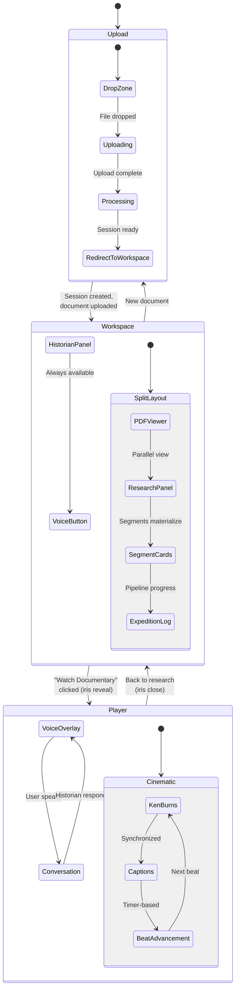

### Four Zustand Stores

State management uses four focused Zustand stores, each owning a distinct domain:

#### sessionStore

```
sessionStore:
  sessionId:        string | null
  documentName:     string | null
  language:         string | null
  status:           "idle" | "uploading" | "processing" | "ready" | "playing"
  accessVerified:   boolean

  Actions:
  - createSession(file) --> sets sessionId, status="uploading"
  - setStatus(status)
  - reset()
```

#### researchStore

```
researchStore:
  phases:           PipelinePhase[]
  agents:           Map<string, AgentState>
  segments:         Map<string, SegmentState>
  stats:            { sourcesFound, factsVerified, segmentsReady }
  logs:             AgentLog[]

  Actions:
  - addPhase(phase)
  - updateAgent(agentId, status, query?)
  - updateSegment(segmentId, data)
  - incrementStat(key)
  - addLog(entry)
```

#### voiceStore

```
voiceStore:
  state:            VoiceState (see state machine below)
  isConnected:      boolean
  isMuted:          boolean
  lastError:        string | null

  Actions:
  - transition(event) --> enforces valid state transitions
  - setConnected(bool)
  - setMuted(bool)
  - setError(string)
```

#### playerStore

```
playerStore:
  currentSegmentIndex:  number
  currentBeatIndex:     number
  isPlaying:            boolean
  isIdle:               boolean     (true after 3s inactivity)
  volume:               number
  playbackRate:         number
  narrationAudio:       ArrayBuffer | null

  Actions:
  - play() / pause()
  - nextBeat() / prevBeat()
  - nextSegment() / prevSegment()
  - setIdle(bool)
  - setVolume(number)
```

### Voice Button State Machine

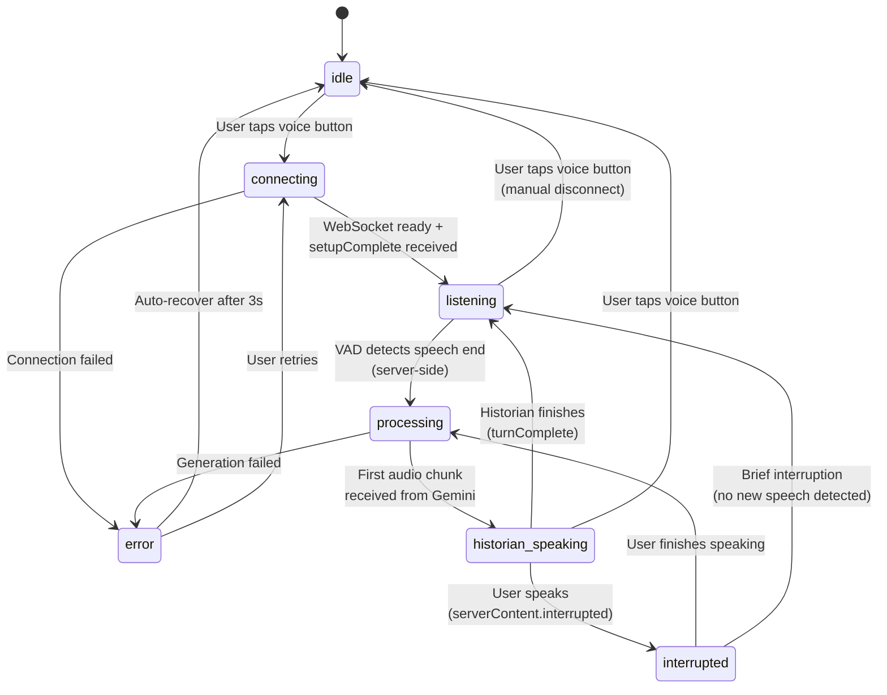

**State visual mapping:**

| State | Voice Button | Waveform | Player |
|---|---|---|---|
| `idle` | Pulsing glow (inviting) | Hidden | Normal playback |
| `connecting` | Spinning ring | Hidden | Normal playback |
| `listening` | Solid glow + mic icon | Active (mic input) | Documentary pauses |
| `processing` | Breathing animation | Flat line | Documentary paused |
| `historian_speaking` | Speaker icon + gold ring | Active (historian audio) | Documentary paused |
| `interrupted` | Flash + transition | Briefly flat | Documentary paused |
| `error` | Red pulse | Hidden | Normal playback |

### Documentary Player: Beat-Driven Narration

The player advances through segments and beats using a timer-based system:

1. Each **beat** has a narration text and a duration (calculated from text length at ~150 words/minute)
2. A timer advances beats automatically during narration playback
3. `turn_complete` signals from the Gemini Live API can accelerate beat advancement (the narrator finished speaking a beat early)
4. The Ken Burns effect (slow pan + zoom on the beat image) runs continuously, with the animation duration driven by audio-reactive CSS custom properties

#### Audio-Visual Synchronization

The `useAudioVisualSync` hook connects the historian's voice to the visual presentation:

```
AnalyserNode.getByteFrequencyData() --> energy calculation per rAF frame

Energy mapping:
  silence (energy < 0.1):
    --ken-speed:    28s    (slow, contemplative camera movement)
    --glow-opacity: 0.5    (subtle vignette)
    --vig-spread:   110%   (tight vignette)
    --cap-shadow:   28px   (standard caption glow)

  peak narration (energy > 0.7):
    --ken-speed:    20s    (faster, more dynamic camera movement)
    --glow-opacity: 1.0    (intense vignette)
    --vig-spread:   140%   (wide vignette, more visible image)
    --cap-shadow:   48px   (expanded caption glow, text breathes with voice)
```

These CSS custom properties are set on the player's root element every animation frame, creating a continuous connection between what the user hears and what they see. The Ken Burns animation literally breathes with the historian's voice.

---

## 7. Data Persistence

### Firestore Schema

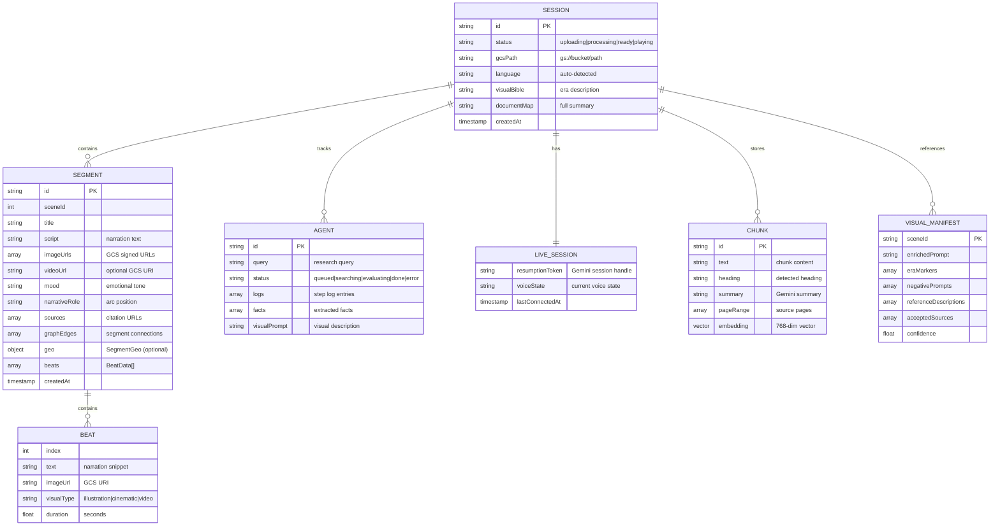

#### Firestore Paths

| Path | Document Type | Written By | Read By |
|---|---|---|---|
| `/sessions/{sessionId}` | Session root | historian-api | All services |
| `/sessions/{sessionId}/segments/{segmentId}` | Segment data | agent-orchestrator | historian-api, live-relay, frontend |
| `/sessions/{sessionId}/agents/{agentId}` | Agent state + logs | agent-orchestrator | historian-api, frontend |
| `/sessions/{sessionId}/liveSession` | Voice session state | live-relay | live-relay (on reconnect) |
| `/sessions/{sessionId}/chunks/{chunkId}` | Document chunks + embeddings | agent-orchestrator | historian-api (RAG search) |
| `/sessions/{sessionId}/visualManifests/{sceneId}` | Visual research output | agent-orchestrator | agent-orchestrator (Phase XI) |

### GCS Bucket Structure

Two logical areas within a single bucket (`gs://{GCS_BUCKET_NAME}/`):

```
gs://{bucket}/
  sessions/{sessionId}/
    document/
      original.pdf              <-- Uploaded document (signed URL PUT)
      ocr_text.txt              <-- Document AI output (backup)
    storyboards/
      scene_0.png               <-- Phase IV storyboard illustrations
      scene_1.png
      ...
    beats/
      seg_0_beat_0.png          <-- Phase V beat illustrations
      seg_0_beat_1.png
      seg_1_beat_0.png
      ...
    images/
      seg_0_frame_0.png         <-- Phase XI Imagen 3 frames
      seg_0_frame_1.png
      seg_0_frame_2.png
      seg_0_frame_3.png
      seg_1_frame_0.png
      ...
    videos/
      seg_0_veo2.mp4            <-- Phase XI Veo 2 clips
      seg_2_veo2.mp4
      ...
```

#### What Goes Where and Why

| Data | Storage | Rationale |
|---|---|---|
| Session metadata, agent status, segment scripts | **Firestore** | Real-time reads, structured queries, vector search for RAG |
| Uploaded documents | **GCS** | Large binary files, signed URL direct upload from browser |
| Generated images (Imagen 3, beat illustrations, storyboards) | **GCS** | Binary blobs, served via signed URLs or CDN |
| Generated videos (Veo 2) | **GCS** | Veo 2 requires `output_gcs_uri`; videos served directly from GCS |
| OCR text backup | **GCS** | Large text, not queried -- pure backup |
| Document chunk embeddings | **Firestore** | Vector search via `find_nearest` -- requires embeddings co-located with document metadata |
| Session resumption tokens | **Firestore** | Low-latency read on reconnect, 2-hour TTL |

---

## 8. Infrastructure and Deployment

### Terraform: One Command Deployment

The `terraform/` directory contains Infrastructure as Code that provisions the entire Google Cloud environment with a single command:

```
cd terraform/
terraform init
terraform apply -var="project_id=YOUR_PROJECT"
```

#### Resources Provisioned (42 total)

| Category | Resources |
|---|---|
| **Cloud Run** | 3 services (historian-api, agent-orchestrator, live-relay) with IAM bindings, custom domains, and scaling configs |
| **Artifact Registry** | 1 Docker repository for container images |
| **Cloud Storage** | 2 buckets (documents + assets) with lifecycle rules and CORS configuration |
| **Firestore** | Database instance with composite indexes for vector search (768 dimensions, COSINE distance) |
| **Document AI** | OCR processor instance |
| **Pub/Sub** | Topics and subscriptions for async messaging |
| **Secret Manager** | Secrets for API keys and service credentials |
| **IAM** | Service accounts with least-privilege roles for each Cloud Run service |
| **Networking** | VPC connector for private service-to-service communication |
| **Cloud Build** | Build triggers linked to the GitHub repository |

### Cloud Build: Parallel Docker Builds

Cloud Build configuration builds all three services in parallel:

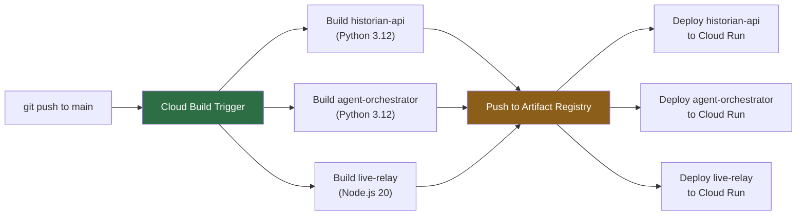

### Cloud Run Service Specifications

| Service | Memory | CPU | Min Instances | Max Instances | Request Timeout | Concurrency |
|---|---|---|---|---|---|---|
| **historian-api** | 2 GiB | 2 vCPU | 0 | 10 | 300s | 80 |
| **agent-orchestrator** | 4 GiB | 4 vCPU | 0 | 5 | 3600s (1 hour) | 1 (pipeline is stateful) |
| **live-relay** | 1 GiB | 1 vCPU | 0 | 10 | 3600s (WebSocket) | 100 |

Key configuration notes:

- **agent-orchestrator** has 1-hour timeout because the full pipeline (especially Veo 2 polling) can take several minutes
- **agent-orchestrator** concurrency is set to 1 because each pipeline run is stateful and memory-intensive
- **live-relay** uses WebSocket support (`--use-http2` disabled) and session affinity for stable connections
- All services use **CPU always allocated** (not throttled between requests) for WebSocket and SSE connections

### Access Code Protection

The application is protected by an access code gate during the competition period:

- **Frontend:** A code entry screen appears before the main application. The code is stored in `sessionStorage` and sent as a header with every API request.
- **Backend:** Middleware on `historian-api` validates the `X-Access-Code` header against a value stored in Secret Manager. Invalid codes receive a 403 response.

This prevents unauthorized usage of the (expensive) Gemini, Imagen 3, and Veo 2 API calls during the public demo period.

---

## 9. Performance Targets

| Metric | Target | How Achieved |
|---|---|---|
| **First segment playable** | < 45 seconds from upload | Fast path in Phase V (Beat 0/Seg 0 first), Scene 0 fast path in Phase X (3 sources, early exit), Scene 0 Imagen 3 before other scenes |
| **Voice interruption latency** | < 300ms | Server-side VAD (no round-trip), immediate audio queue flush, no debounce on interrupt signal |
| **Historian response start** | < 1.5 seconds after user speech ends | Gemini 2.5 Flash Native Audio real-time streaming, pre-built system instruction, low-latency WebSocket relay |
| **RAG retrieval** | < 500ms | Firestore vector search with pre-computed 768-dim embeddings, co-located data, 5-result limit |
| **Research subagent completion** | < 30 seconds per agent | 3 focused search queries (not open-ended), Gemini 2.0 Flash for speed |
| **Imagen 3 generation** | ~5 seconds per image | `imagen-3.0-fast-generate-001` (fast variant), 4 concurrent frames via asyncio.gather |
| **Veo 2 video generation** | 1-2 minutes per clip | Async fire-and-forget, polled in background, does not block segment delivery |
| **Frontend initial bundle** | < 200 KB gzipped | Vite code splitting, dynamic imports for Player and PDF viewer, tree-shaking |
| **Animation frame budget** | 60 fps maintained | rAF loops capped, CSS custom property animations (GPU-accelerated), no layout thrashing |
| **SSE reconnection** | < 2 seconds | Native EventSource auto-reconnect, Last-Event-ID replay, drip buffer absorbs burst |
| **Pipeline resume** | < 10 seconds | ResumablePipelineAgent checkpoints per phase, restarts from last completed phase |
| **Document AI OCR** | < 10 seconds for 15-page PDF | Online processing for small documents, async batch for large ones |
| **Total pipeline (all phases)** | 3-5 minutes | Parallel execution where possible, progressive delivery, fast paths for Scene 0 |

### Latency Budget Breakdown: First Segment Playable

```
Upload to GCS (signed URL PUT):       ~2s
Document AI OCR:                       ~8s
Semantic chunking + summarization:     ~5s
Narrative Curator:                     ~5s
Phase II research (parallel):          ~15s
Phase III script generation:           ~8s
Phase V Beat 0/Seg 0 (fast path):     ~5s
                                       -----
Total:                                 ~48s (target: <45s with optimization)
```

The critical path runs through Phases I, II, III, and V (Beat 0 only). Phases VII, IV, VI, VIII, X, and XI run after the first segment is playable and do not affect this metric.

### Latency Budget Breakdown: Voice Interruption

```
User speech detected by server VAD:    ~50ms
Gemini generates interrupted signal:   ~50ms
WebSocket relay to browser:            ~30ms
Browser processes interrupt:           ~10ms
Audio queue flush + silence:           ~10ms
                                       -----
Total:                                 ~150ms (well under 300ms target)
```

---

## Appendix A: Model Usage Summary

| Model | Version | Phases | Calls per Session | Purpose |
|---|---|---|---|---|
| Gemini 2.0 Flash | `gemini-2.0-flash` | I, II, VII, IV, V, VI, VIII, X | ~50-100 | Fast reasoning: summarization, research, evaluation, illustration |
| Gemini 2.0 Pro | `gemini-2.0-pro` | I (curator), III | ~5-10 | High-quality generation: scene selection, script writing |
| Gemini 2.5 Flash Native Audio | `gemini-2.5-flash-native-audio-preview-12-2025` | Live voice | Continuous stream | Real-time voice conversation |
| Imagen 3 Fast | `imagen-3.0-fast-generate-001` | XI, live illustration | ~20-30 | Image generation at 200 req/min capacity |
| Veo 2 | `veo-2.0-generate-001` | XI | ~2-4 | Video clip generation (async, 1-2 min each) |
| Gemini Embedding | `gemini-embedding-2-preview` | RAG setup | ~20-40 | 768-dim embeddings for vector search |

## Appendix B: ADK Pattern Reference

### Custom BaseAgent Pattern

All complex phases use a custom `BaseAgent` with Pydantic v2 configuration:

```python
class MyOrchestrator(BaseAgent):
    emitter: SSEEmitter  # Custom field
    model_config = ConfigDict(arbitrary_types_allowed=True)

    async def _run_async_impl(self, ctx) -> AsyncGenerator[Event, None]:
        # Phase logic here
        await self.emitter.emit("agent_status", {...})
        # ...
        return; yield  # Satisfies AsyncGenerator protocol without yielding ADK events
```

### Session State Communication

Agents share data via `session.state`:

```python
# Writer (Phase I)
ctx.session.state["scene_briefs"] = json.dumps(briefs)

# Reader (Phase II) — via ADK template syntax in agent instructions
instruction = "Research these scenes: {scene_briefs}"
# ADK resolves {scene_briefs} from session.state at runtime
```

### ParallelAgent with Dynamic Sub-Agents

Phase II builds the ParallelAgent at runtime based on the number of scenes:

```python
def _build_parallel_research(self, n: int) -> ParallelAgent:
    agents = [
        Agent(
            name=f"researcher_{i}",
            model="gemini-2.0-flash",
            tools=[google_search],
            output_key=f"research_{i}",
            instruction=f"Research: {{scene_{i}_brief}}\nContext: {{scene_{i}_chunks}}"
        )
        for i in range(n)
    ]
    return ParallelAgent(name="parallel_research", sub_agents=agents)
```

The double-brace trick (`{{scene_{i}_brief}}`) produces `{scene_0_brief}` in the output string, which ADK then resolves from session state.

### Factory Pattern

Each phase agent is constructed via a factory function that reads environment configuration:

```python
def build_visual_director(emitter: SSEEmitter) -> VisualDirectorOrchestrator:
    project_id = os.environ["GCP_PROJECT_ID"]
    bucket_name = os.environ["GCS_BUCKET_NAME"]
    client = genai.Client(vertexai=True, project=project_id, location="us-central1")
    return VisualDirectorOrchestrator(
        name="visual_director_orch",
        emitter=emitter,
        client=client,
        bucket_name=bucket_name,
    )
```

---

## Appendix C: Environment Variables

| Variable | Service | Required | Description |
|---|---|---|---|
| `GCP_PROJECT_ID` | All | Yes | Google Cloud project ID |
| `GCS_BUCKET_NAME` | agent-orchestrator, historian-api | Yes | Primary storage bucket |
| `DOCUMENT_AI_PROCESSOR_NAME` | agent-orchestrator | Yes | Full Document AI processor resource name |
| `FIRESTORE_DATABASE` | All | No | Firestore database name (default: `(default)`) |
| `GEMINI_API_KEY` | live-relay | Yes | API key for Gemini Live API (AI Studio path) |
| `ACCESS_CODE` | historian-api | Yes | Access code for frontend gate |
| `CORS_ORIGINS` | historian-api | No | Allowed CORS origins (default: `*` in dev) |
| `PORT` | All | No | Service port (default: 8080/8081/8082) |
