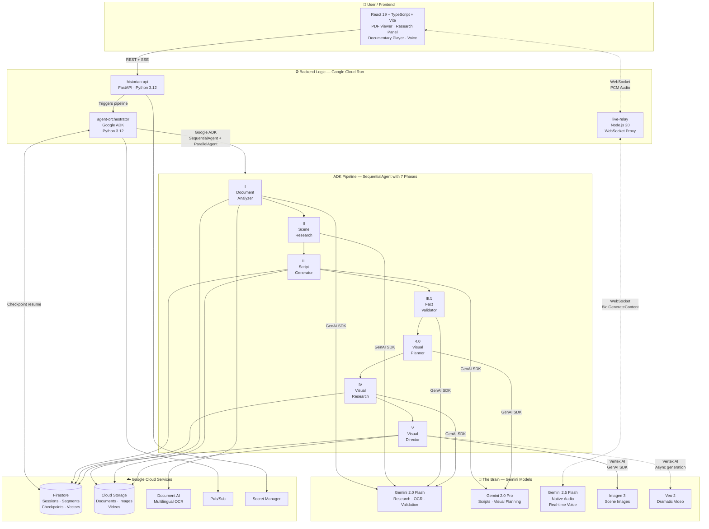
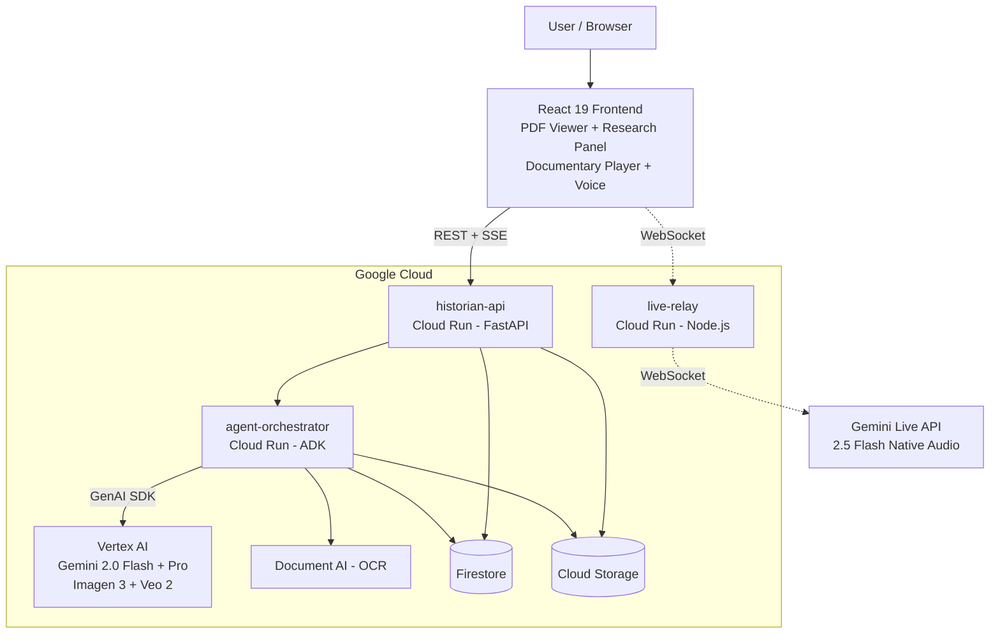

# Architecture Diagram — Mermaid Reference

This file contains the production Mermaid architecture diagram for the AI Historian
README.md. Copy the fenced code block into README.md verbatim.

---

## Research Notes: Mermaid on GitHub

### How GitHub renders Mermaid

GitHub natively renders Mermaid inside fenced code blocks tagged with `mermaid`.
No plugins, no build steps, no image generation required.

````

````

Supported locations: README files, Issues, Discussions, Pull Requests, Wikis,
and any Markdown file rendered by GitHub.

### Flowchart TD vs Graph LR

| Syntax       | Direction     | Best for                                |
|--------------|---------------|-----------------------------------------|
| `flowchart TD` | Top to Down  | Hierarchical systems, layered architectures |
| `flowchart LR` | Left to Right | Sequential pipelines, data flow          |

For this project, `flowchart TD` is the correct choice. The architecture has a
clear top-to-bottom hierarchy: User at the top, Google Cloud services at the
bottom. `LR` would make the diagram excessively wide given the number of
components.

### Bidirectional flows

Mermaid supports `<-->` for bidirectional arrows in flowchart diagrams:
```
A <--> B
```

For labeled bidirectional arrows:
```
A <-- "label" --> B
```

### Async and WebSocket connections

Mermaid has no built-in async or WebSocket arrow style. Convention is to use
dotted lines (`-.->` or `-..->`) for async/non-blocking connections and label
them explicitly:

```
A -.-> |"WebSocket"| B
A -.-> |"async"| C
```

Solid lines (`-->`) represent synchronous REST/RPC calls.
Dotted lines (`-.->`) represent async, streaming, or WebSocket connections.

### Known GitHub Mermaid limitations to avoid

1. **No FontAwesome icons** -- `fa:fa-icon` syntax does not render on GitHub.
2. **No hyperlinks in nodes** -- `click` actions and URLs are ignored.
3. **No tooltips** -- `title` attributes on nodes do not render.
4. **No HTML in node labels** -- `<br>` and other HTML tags break rendering.
   Use `\n` or just write short labels.
5. **Special characters in labels** -- Parentheses `()`, brackets `[]`, and
   curly braces `{}` in label text must be inside quotes: `A["label (text)"]`.
6. **No custom CSS** -- `classDef` works but color rendering is inconsistent
   across GitHub light/dark themes. Keep styling minimal.
7. **Diagram size** -- Very large diagrams may render poorly or be cut off.
   Keep under ~40 nodes for reliable rendering.
8. **No `&` in labels** -- Use `and` instead of `&` in unquoted labels.
9. **Subgraph titles** -- Must not contain special characters without quotes.
10. **Version lag** -- GitHub may be several Mermaid versions behind the latest
    release. Avoid bleeding-edge syntax. Stick to flowchart, sequence, and
    class diagram types which have the most stable support.

### Best practices for architecture diagrams

- Use subgraphs to group related services visually.
- Use consistent node shapes: rounded rectangles `()` for services, cylinders
  `[()]` for databases, hexagons `{{}}` for external APIs.
- Label every edge with the protocol or data type.
- Keep labels short (under 40 characters).
- Use `direction TB` inside subgraphs if needed for local layout control.

---

## The Diagram (v3 — Competition-Aligned)

Restructured around the 4 sections judges explicitly look for:
1. **User/Frontend** — how the user interacts
2. **The Brain** — where Gemini models sit and how they're accessed (GenAI SDK / ADK)
3. **The Logic** — backend hosted on Google Cloud
4. **The Connections** — how pieces talk to each other



---

## Compact Version

If the full diagram renders too wide on some screens, here is a simplified
version with fewer nodes that still meets judging requirements (shows User,
Frontend, Gemini model location, backend on Google Cloud, all connections):



---

## Usage in README.md

Paste either diagram inside the Architecture section of README.md. The fenced
code block must start with exactly three backticks followed by `mermaid` on the
same line. No spaces before `mermaid`. No additional metadata.

Example:

````markdown
## Architecture


````

GitHub will render it as an interactive SVG diagram. No build step needed.

To preview locally before pushing:
- VS Code: install the "Markdown Preview Mermaid Support" extension
- CLI: `npx @mermaid-js/mermaid-cli mmdc -i docs/architecture/architecture-diagram.md -o diagram.svg`
- Web: paste into https://mermaid.live/

---

## Judging Checklist Coverage (FAQ Q5)

The diagram is structured around the 4 sections judges explicitly require:

| FAQ Requirement | Section | How it's shown |
|---|---|---|
| **User/Frontend**: How the user interacts | `👤 User / Frontend` subgraph | React 19 app with PDF Viewer, Research Panel, Documentary Player, Voice |
| **The Brain**: Where Gemini sits and how it's accessed | `🧠 The Brain — Gemini Models` subgraph | 5 Gemini models; edges labeled "GenAI SDK", "Google ADK", "Vertex AI" |
| **The Logic**: Backend on Google Cloud | `⚙️ Backend Logic — Google Cloud Run` subgraph | 3 Cloud Run services + ADK Pipeline subgraph |
| **The Connections**: How pieces talk | Labeled edges throughout | REST+SSE, WebSocket, GenAI SDK, ADK, Vertex AI, checkpoint resume |
| Google Cloud services visible | `☁️ Google Cloud Services` subgraph | Firestore, Cloud Storage, Document AI, Pub/Sub, Secret Manager |
